# Turbo Tenant · Engineering Atlas

A source-linked map of the tenant host, plugin modules, storefront, data declarations, and request boundaries. Start with the architecture, then follow individual routes and workflows.

Open [the offline explorer](index.html). All SVG diagrams and inventories are embedded in that file.

## Rebuild

```sh
python .agents/skills/engineering-atlas/scripts/atlas.py build . --observe --render-deps /path/to/renderer-dependencies
python .agents/skills/engineering-atlas/scripts/atlas.py check .
```

`--observe` boots the configured application to read route registration. Review provider side effects first; it does not dispatch a request or initialize a tenant. Install renderer dependencies in a separate directory using the skill tooling/package.json.

## Views

### System context · people and external systems

C4 context view inferred from source integrations. Actors are usage categories; deployed connections and permissions have not been exercised.

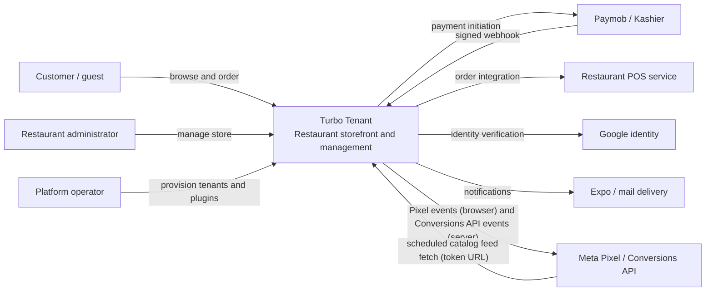
```mermaid
flowchart LR
 Customer["Customer / guest"] -->|browse and order| Turbo["Turbo Tenant
Restaurant storefront and management"]
 Admin["Restaurant administrator"] -->|manage store| Turbo
 Operator["Platform operator"] -->|provision tenants and plugins| Turbo
 Turbo -->|payment initiation| Payments["Paymob / Kashier"]
 Payments -->|signed webhook| Turbo
 Turbo -->|order integration| POS["Restaurant POS service"]
 Turbo -->|identity verification| Google["Google identity"]
 Turbo -->|notifications| Expo["Expo / mail delivery"]
 Turbo -->|"Pixel events (browser) and Conversions API events (server)"| Meta["Meta Pixel / Conversions API"]
 Meta -->|"scheduled catalog feed fetch (token URL)"| Turbo
```

### Applications and data boundaries

C4 container-level logical view. Queue driver, infrastructure placement, running workers, and external availability are unverified.

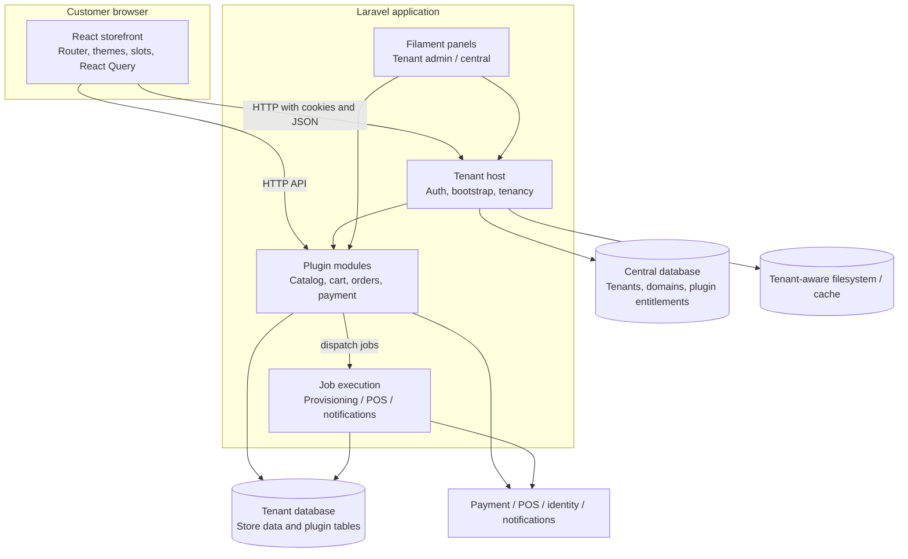
```mermaid
flowchart TB
 subgraph Browser["Customer browser"]
 SPA["React storefront
Router, themes, slots, React Query"]
 end
 subgraph Backend["Laravel application"]
 Host["Tenant host
Auth, bootstrap, tenancy"]
 Plugins["Plugin modules
Catalog, cart, orders, payment"]
 Panels["Filament panels
Tenant admin / central"]
 Jobs["Job execution
Provisioning / POS / notifications"]
 end
 Central[("Central database
Tenants, domains, plugin entitlements")]
 Tenant[("Tenant database
Store data and plugin tables")]
 Storage[("Tenant-aware filesystem / cache")]
 External["Payment / POS / identity / notifications"]
 SPA -->|HTTP with cookies and JSON| Host
 SPA -->|HTTP API| Plugins
 Host --> Plugins
 Panels --> Host
 Panels --> Plugins
 Host --> Central
 Plugins --> Tenant
 Host --> Storage
 Plugins -->|dispatch jobs| Jobs
 Jobs --> Tenant
 Plugins --> External
 Jobs --> External
```

### Plugin host and extension architecture

Source-reviewed component view. Provider registration, tenant activation, frontend plugin slots, and theme overrides are separate mechanisms.

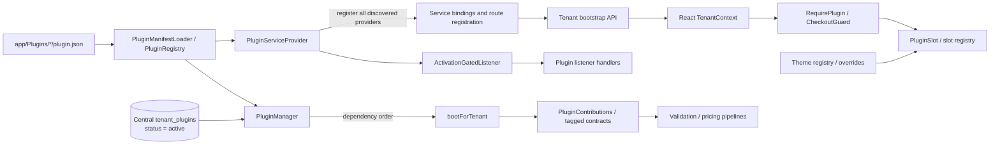
```mermaid
flowchart LR
 Manifests["app/Plugins/*/plugin.json"] --> Registry["PluginManifestLoader / PluginRegistry"]
 Registry --> Provider["PluginServiceProvider"]
 Provider -->|register all discovered providers| Bindings["Service bindings and route registration"]
 Registry --> Manager["PluginManager"]
 Active[("Central tenant_plugins
status = active")] --> Manager
 Manager -->|dependency order| Boot["bootForTenant"]
 Boot --> Contributions["PluginContributions / tagged contracts"]
 Contributions --> Pipelines["Validation / pricing pipelines"]
 Provider --> Wrapper["ActivationGatedListener"]
 Wrapper --> Events["Plugin listener handlers"]
 Bindings --> API["Tenant bootstrap API"]
 API --> Context["React TenantContext"]
 Context --> Guards["RequirePlugin / CheckoutGuard"]
 Guards --> Slots["PluginSlot / slot registry"]
 Theme["Theme registry / overrides"] --> Slots
```

### Tenant request boundaries and route controls

Source-reviewed logical decision flow, not a universal middleware ordering claim. The route inventory contains Laravel’s expanded priority order for each registered route.

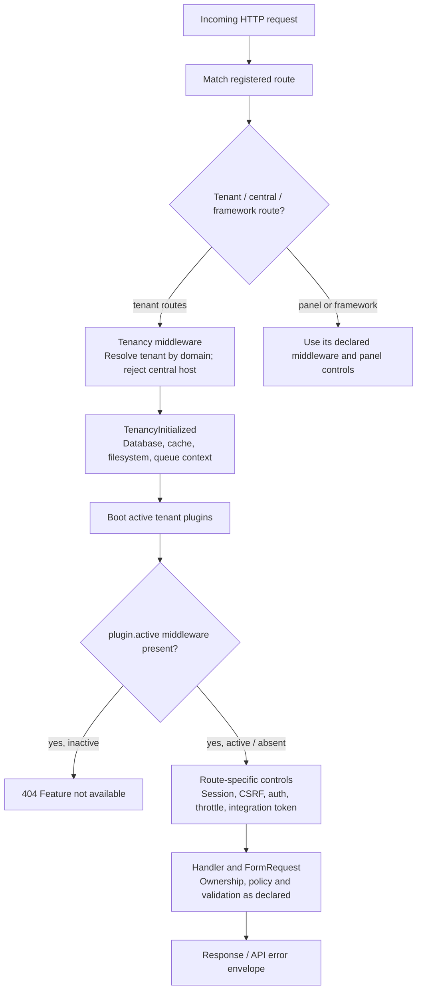
```mermaid
flowchart TD
 Request["Incoming HTTP request"] --> Registered["Match registered route"]
 Registered --> RouteType{"Tenant / central / framework route?"}
 RouteType -->|tenant routes| Identify["Tenancy middleware
Resolve tenant by domain; reject central host"]
 RouteType -->|panel or framework| Other["Use its declared middleware and panel controls"]
 Identify --> Bootstrap["TenancyInitialized
Database, cache, filesystem, queue context"]
 Bootstrap --> Boot["Boot active tenant plugins"]
 Boot --> Gate{"plugin.active middleware present?"}
 Gate -->|yes, inactive| Unavailable["404 Feature not available"]
 Gate -->|yes, active / absent| Controls["Route-specific controls
Session, CSRF, auth, throttle, integration token"]
 Controls --> Handler["Handler and FormRequest
Ownership, policy and validation as declared"]
 Handler --> Response["Response / API error envelope"]
```

### Checkout · browser to order and payment

Reviewed control flow. Browser permission and server customer resolution are separate. Pipeline contributions depend on active tenant plugins. Failures are summarized at their actual stage. A first authenticated delivery address is saved before order placement; a failed address save prevents the order request.

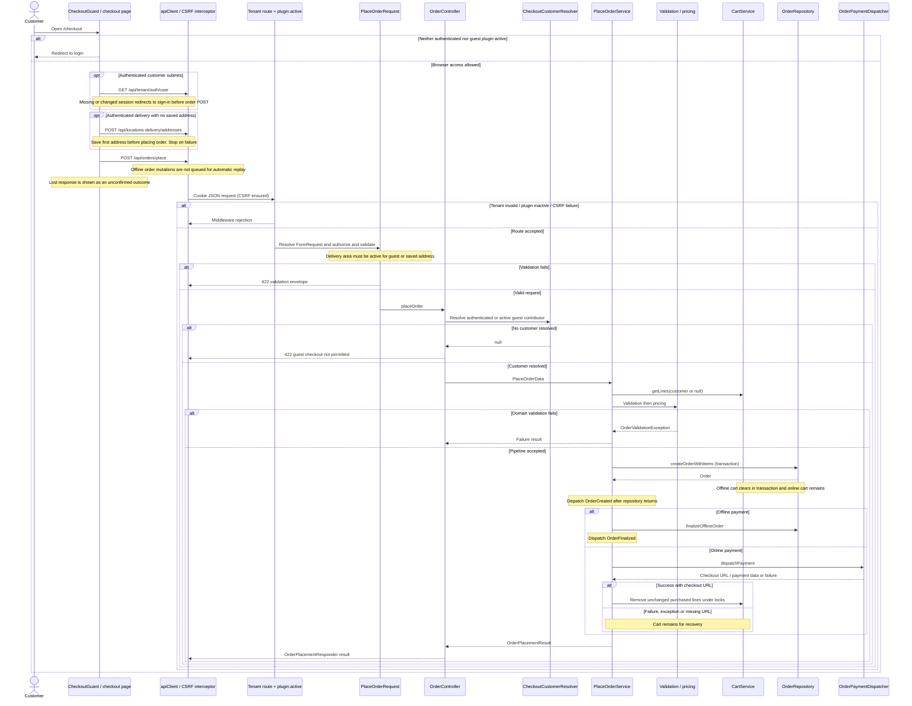
```mermaid
sequenceDiagram
 actor Customer
 participant UI as CheckoutGuard / checkout page
 participant Client as apiClient / CSRF interceptor
 participant Route as Tenant route + plugin.active
 participant Request as PlaceOrderRequest
 participant Controller as OrderController
 participant Resolver as CheckoutCustomerResolver
 participant Service as PlaceOrderService
 participant Pipeline as Validation / pricing
 participant Cart as CartService
 participant Repo as OrderRepository
 participant Payment as OrderPaymentDispatcher
 Customer->>UI: Open /checkout
 alt Neither authenticated nor guest plugin active
 UI-->>Customer: Redirect to login
 else Browser access allowed
 opt Authenticated customer submits
 UI->>Client: GET /api/tenant/auth/user
 Note over UI,Client: Missing or changed session redirects to sign-in before order POST
 end
 opt Authenticated delivery with no saved address
 UI->>Client: POST /api/locations-delivery/addresses
 Note over UI,Client: Save first address before placing order. Stop on failure
 end
 UI->>Client: POST /api/orders/place
 Note over Client: Offline order mutations are not queued for automatic replay
 Note over UI: Lost response is shown as an unconfirmed outcome
 Client->>Route: Cookie JSON request (CSRF ensured)
 alt Tenant invalid / plugin inactive / CSRF failure
 Route-->>Client: Middleware rejection
 else Route accepted
 Route->>Request: Resolve FormRequest and authorize and validate
 Note over Request: Delivery area must be active for guest or saved address
 alt Validation fails
 Request-->>Client: 422 validation envelope
 else Valid request
 Request->>Controller: placeOrder
 Controller->>Resolver: Resolve authenticated or active guest contributor
 alt No customer resolved
 Resolver-->>Controller: null
 Controller-->>Client: 422 guest checkout not permitted
 else Customer resolved
 Controller->>Service: PlaceOrderData
 Service->>Cart: getLines(customer or null)
  Service->>Pipeline: Validation then pricing
 alt Domain validation fails
 Pipeline-->>Service: OrderValidationException
 Service-->>Controller: Failure result
 else Pipeline accepted
 Service->>Repo: createOrderWithItems (transaction)
 Repo-->>Service: Order
 Note over Repo,Cart: Offline cart clears in transaction and online cart remains
 Note over Service: Dispatch OrderCreated after repository returns
 alt Offline payment
 Service->>Repo: finalizeOfflineOrder
 Note over Service: Dispatch OrderFinalized
 else Online payment
 Service->>Payment: dispatchPayment
 Payment-->>Service: Checkout URL / payment data or failure
 alt Success with checkout URL
 Service->>Cart: Remove unchanged purchased lines under locks
 else Failure, exception or missing URL
 Note over Service,Cart: Cart remains for recovery
 end
 end
 Service-->>Controller: OrderPlacementResult
 Controller-->>Client: OrderPlacementResponder result
 end
 end
 end
 end
 end
```

### Payment webhook · validation and state transition

Webhooks are tenant-scoped but intentionally lack the plugin.active route gate and CSRF checks. Signature validation and business checks occur inside the payment service.

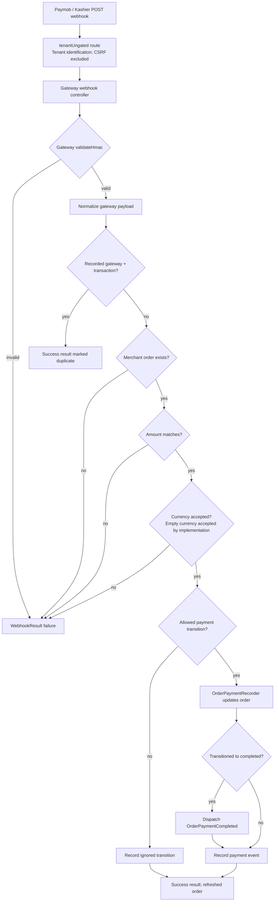
```mermaid
flowchart TD
 Gateway["Paymob / Kashier POST webhook"] --> Route["tenantUngated route
Tenant identification; CSRF excluded"]
 Route --> Controller["Gateway webhook controller"]
 Controller --> Signature{"Gateway validateHmac"}
 Signature -->|invalid| Failure["WebhookResult failure"]
 Signature -->|valid| Process["Normalize gateway payload"]
 Process --> Duplicate{"Recorded gateway + transaction?"}
 Duplicate -->|yes| Ack["Success result marked duplicate"]
 Duplicate -->|no| Order{"Merchant order exists?"}
 Order -->|no| Failure
 Order -->|yes| Amount{"Amount matches?"}
 Amount -->|no| Failure
 Amount -->|yes| Currency{"Currency accepted?
Empty currency accepted by implementation"}
 Currency -->|no| Failure
 Currency -->|yes| Transition{"Allowed payment transition?"}
 Transition -->|no| Ignore["Record ignored transition"]
 Transition -->|yes| Record["OrderPaymentRecorder updates order"]
 Record --> Completed{"Transitioned to completed?"}
 Completed -->|yes| Event["Dispatch OrderPaymentCompleted"]
 Completed -->|no| EventRecord["Record payment event"]
 Event --> EventRecord
 Ignore --> Success["Success result; refreshed order"]
 EventRecord --> Success
```

### Order POS delivery tracking and recovery

Source-reviewed tenant dispatch, durable attempt tracking and Filament recovery. Isolated tests exercise a central database worker and fake POS responses; this does not prove deployed workers or remote deduplication.

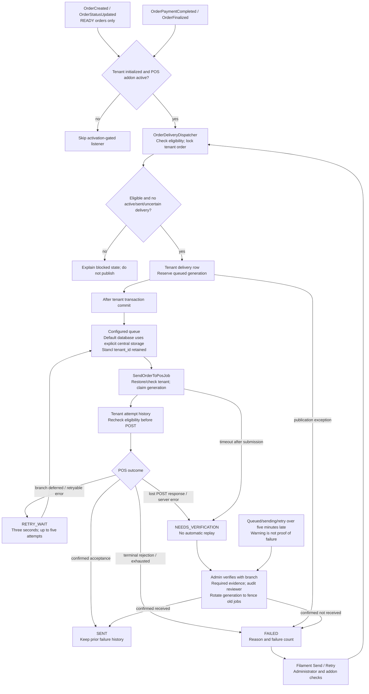
```mermaid
flowchart TD
 Event["OrderCreated / OrderStatusUpdated
READY orders only"] --> Gate{"Tenant initialized and POS addon active?"}
 Payment["OrderPaymentCompleted / OrderFinalized"] --> Gate
 Gate -->|no| Skip["Skip activation-gated listener"]
 Gate -->|yes| Dispatch["OrderDeliveryDispatcher
Check eligibility; lock tenant order"]
 Admin["Filament Send / Retry
Administrator and addon checks"] --> Dispatch
 Dispatch --> State{"Eligible and no active/sent/uncertain delivery?"}
 State -->|no| Block["Explain blocked state; do not publish"]
 State -->|yes| Persist["Tenant delivery row
Reserve queued generation"]
 Persist --> Commit["After tenant transaction commit"]
 Commit --> Queue["Configured queue
Default database uses explicit central storage
Stancl tenant_id retained"]
 Queue --> Worker["SendOrderToPosJob
Restore/check tenant; claim generation"]
 Worker --> Attempt["Tenant attempt history
Recheck eligibility before POST"]
 Attempt --> Result{"POS outcome"}
 Result -->|confirmed acceptance| Sent["SENT
Keep prior failure history"]
 Result -->|branch deferred / retryable error| Retry["RETRY_WAIT
Three seconds; up to five attempts"]
 Retry --> Queue
 Result -->|terminal rejection / exhausted| Failed["FAILED
Reason and failure count"]
 Failed --> Admin
 Result -->|lost POST response / server error| Unknown["NEEDS_VERIFICATION
No automatic replay"]
 Worker -->|timeout after submission| Unknown
 Persist -->|publication exception| Failed
 Unknown --> Review["Admin verifies with branch
Required evidence; audit reviewer
Rotate generation to fence old jobs"]
 Overdue["Queued/sending/retry over five minutes late
Warning is not proof of failure"] --> Review
 Review -->|confirmed received| Sent
 Review -->|confirmed not received| Failed
```

### Meta integration · Pixel, Conversions API and catalog

Source-reviewed component view of the meta-marketing plugin. Storefront code emits vendor-neutral commerce events; only the meta-marketing frontend plugin talks to the Pixel and the relay endpoint. Purchase is server-authoritative: it is never relayed and is sent by queued jobs from order events. Browser and server copies share an event_id so Meta deduplicates them. Delivery to the live Graph API has not been exercised by this atlas.

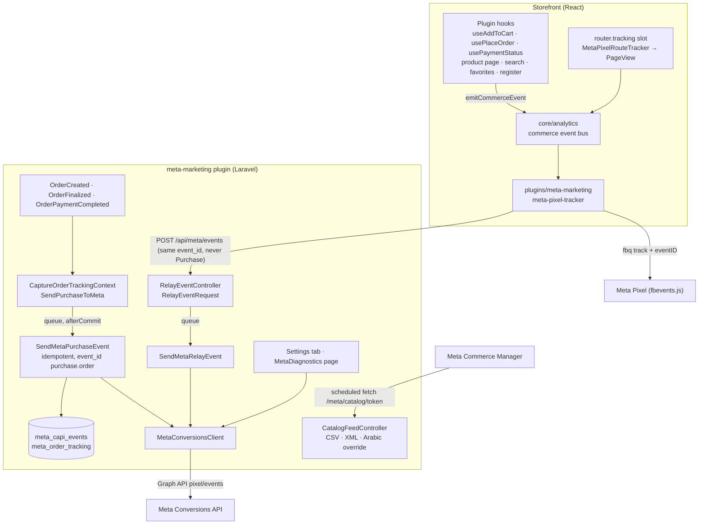
```mermaid
flowchart TB
 subgraph Browser["Storefront (React)"]
  Emitters["Plugin hooks
useAddToCart · usePlaceOrder · usePaymentStatus
product page · search · favorites · register"] -->|emitCommerceEvent| Bus["core/analytics
commerce event bus"]
  Route["router.tracking slot
MetaPixelRouteTracker → PageView"] --> Bus
  Bus --> Tracker["plugins/meta-marketing
meta-pixel-tracker"]
 end
 Tracker -->|"fbq track + eventID"| Pixel["Meta Pixel (fbevents.js)"]
 Tracker -->|"POST /api/meta/events (same event_id, never Purchase)"| Relay["RelayEventController
RelayEventRequest"]
 subgraph Server["meta-marketing plugin (Laravel)"]
  Relay -->|queue| RelayJob["SendMetaRelayEvent"]
  Orders["OrderCreated · OrderFinalized · OrderPaymentCompleted"] --> Listeners["CaptureOrderTrackingContext
SendPurchaseToMeta"]
  Listeners -->|"queue, afterCommit"| PurchaseJob["SendMetaPurchaseEvent
idempotent, event_id purchase.order"]
  RelayJob --> Client["MetaConversionsClient"]
  PurchaseJob --> Client
  PurchaseJob --> Log[("meta_capi_events
meta_order_tracking")]
  Feed["CatalogFeedController
CSV · XML · Arabic override"]
  Admin["Settings tab · MetaDiagnostics page"] --> Client
 end
 Client -->|"Graph API pixel/events"| CAPI["Meta Conversions API"]
 Commerce["Meta Commerce Manager"] -->|"scheduled fetch /meta/catalog/token"| Feed
```

### Meta Purchase · COD at placement, online after payment

Reviewed control flow for the Purchase conversion. COD orders are finalized and reported inside the placement request; online orders are reported only when the payment state machine transitions to completed. The job skips POS orders, disabled CAPI and already-sent orders, writes every attempt to meta_capi_events, retries 5xx/connection errors and stops on 4xx.

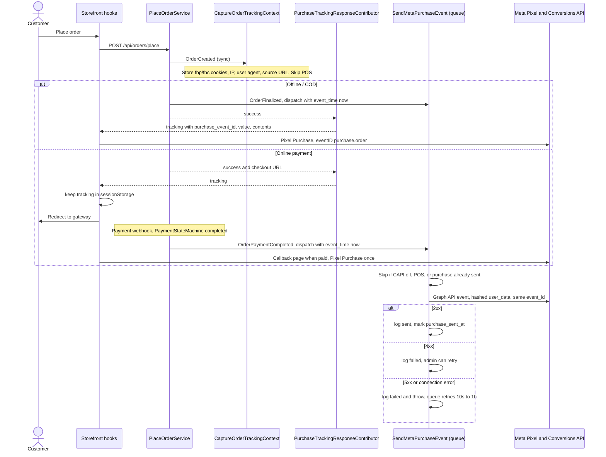
```mermaid
sequenceDiagram
 actor Customer
 participant SPA as Storefront hooks
 participant Place as PlaceOrderService
 participant Capture as CaptureOrderTrackingContext
 participant Resp as PurchaseTrackingResponseContributor
 participant Job as SendMetaPurchaseEvent (queue)
 participant Meta as Meta Pixel and Conversions API
 Customer->>SPA: Place order
 SPA->>Place: POST /api/orders/place
 Place->>Capture: OrderCreated (sync)
 Note over Capture: Store fbp/fbc cookies, IP, user agent, source URL. Skip POS
 alt Offline / COD
  Place->>Job: OrderFinalized, dispatch with event_time now
  Place-->>Resp: success
  Resp-->>SPA: tracking with purchase_event_id, value, contents
  SPA->>Meta: Pixel Purchase, eventID purchase.order
 else Online payment
  Place-->>Resp: success and checkout URL
  Resp-->>SPA: tracking
  SPA->>SPA: keep tracking in sessionStorage
  SPA->>Customer: Redirect to gateway
  Note over Place: Payment webhook, PaymentStateMachine completed
  Place->>Job: OrderPaymentCompleted, dispatch with event_time now
  SPA->>Meta: Callback page when paid, Pixel Purchase once
 end
 Job->>Job: Skip if CAPI off, POS, or purchase already sent
 Job->>Meta: Graph API event, hashed user_data, same event_id
 alt 2xx
  Job->>Job: log sent, mark purchase_sent_at
 else 4xx
  Job->>Job: log failed, admin can retry
 else 5xx or connection error
  Job->>Job: log failed and throw, queue retries 10s to 1h
 end
```

### Meta catalog feed · request to rows

Reviewed flow of the catalog export. Prices mirror CartPriceCalculator so the advertised price equals the charged price (variant price as-is; product discount only when below base). Products without an image are skipped; inactive products are listed as out of stock. The feed is generated on every fetch, so it is never stale; it deliberately avoids the Laravel cache because tenancy's cache bootstrapper needs a taggable store and the app runs on the database store.

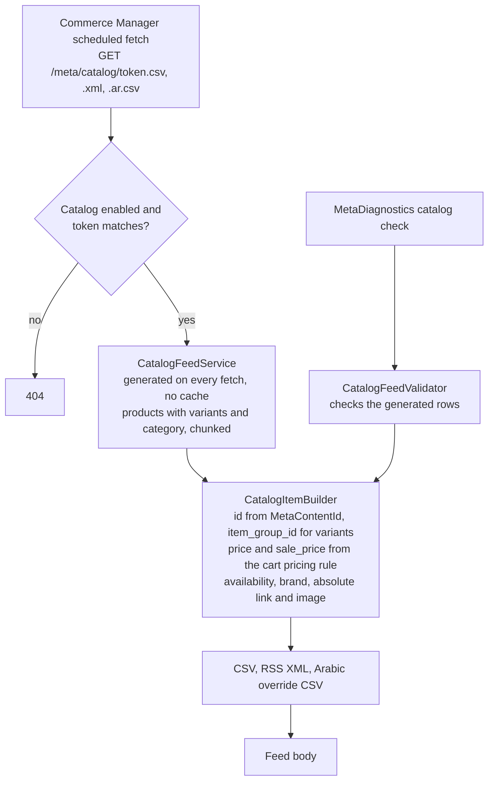
```mermaid
flowchart TD
 Fetch["Commerce Manager scheduled fetch
GET /meta/catalog/token.csv, .xml, .ar.csv"] --> Gate{"Catalog enabled and
token matches?"}
 Gate -->|no| NotFound["404"]
 Gate -->|yes| Build["CatalogFeedService
generated on every fetch, no cache
products with variants and category, chunked"]
 Build --> Item["CatalogItemBuilder
id from MetaContentId, item_group_id for variants
price and sale_price from the cart pricing rule
availability, brand, absolute link and image"]
 Item --> Writer["CSV, RSS XML, Arabic override CSV"]
 Writer --> Body["Feed body"]
 Admin["MetaDiagnostics catalog check"] --> Validator["CatalogFeedValidator
checks the generated rows"]
 Validator --> Item
```

### Browser routes and declared guards

Router wrappers only. Page components and backend handlers can impose additional controls.

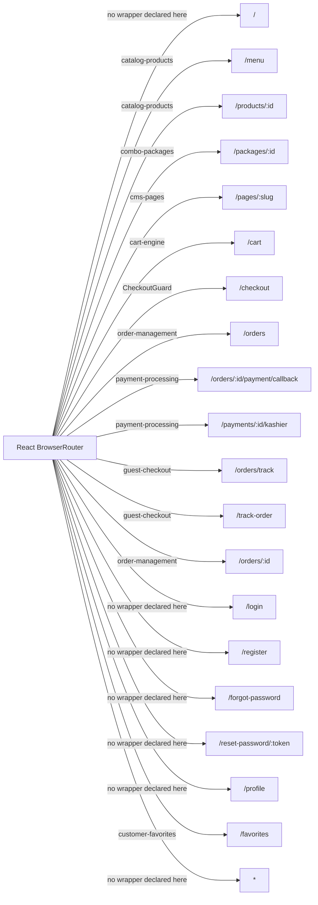
```mermaid
flowchart LR
  Router["React BrowserRouter"]
  Router -->|"no wrapper declared here"| n478ce95e7408["/"]
  Router -->|"catalog-products"| n838e995e04d4["/menu"]
  Router -->|"catalog-products"| n7ba9cea82480["/products/:id"]
  Router -->|"combo-packages"| nd4b3ca954b01["/packages/:id"]
  Router -->|"cms-pages"| ncad16dc09ee5["/pages/:slug"]
  Router -->|"cart-engine"| nae58761cb58c["/cart"]
  Router -->|"CheckoutGuard"| nb1a280eb79d3["/checkout"]
  Router -->|"order-management"| n05abb58ab0ac["/orders"]
  Router -->|"payment-processing"| n1ae0624f9bb6["/orders/:id/payment/callback"]
  Router -->|"payment-processing"| naf537c37b108["/payments/:id/kashier"]
  Router -->|"guest-checkout"| n021737abcb34["/orders/track"]
  Router -->|"guest-checkout"| ncc675ed6b9e9["/track-order"]
  Router -->|"order-management"| nce966e7d43f0["/orders/:id"]
  Router -->|"no wrapper declared here"| n97093c51da49["/login"]
  Router -->|"no wrapper declared here"| ne6142c989523["/register"]
  Router -->|"no wrapper declared here"| nfdb1265d40b2["/forgot-password"]
  Router -->|"no wrapper declared here"| n9f37d2e6f153["/reset-password/:token"]
  Router -->|"no wrapper declared here"| n8e94ba8c5cf0["/profile"]
  Router -->|"customer-favorites"| nc126fc9dd4dc["/favorites"]
  Router -->|"no wrapper declared here"| n59093aad3875["*"]
```

### Manifest event subscriptions

Manifest-declared subscriptions. ActivationGatedListener invokes listeners only within an initialized tenant with the subscribing plugin active. Queue behavior is determined by each listener/job.

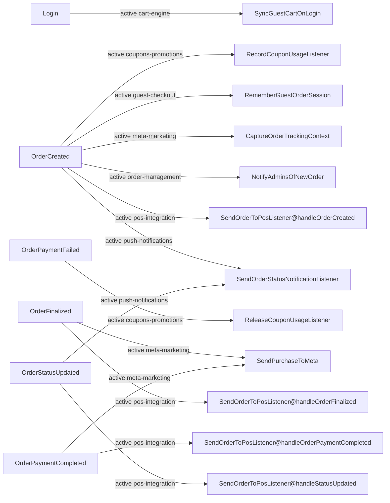
```mermaid
flowchart LR
  nba2a12c0a726["Login"] -->|"active cart-engine"| nb64a58be4409["SyncGuestCartOnLogin"]
  n7b96db9ef91b["OrderCreated"] -->|"active coupons-promotions"| n28df9726ce8a["RecordCouponUsageListener"]
  n0b7285891f8b["OrderPaymentFailed"] -->|"active coupons-promotions"| n9cdf5e4ff512["ReleaseCouponUsageListener"]
  n7b96db9ef91b["OrderCreated"] -->|"active guest-checkout"| nb2b7d1919ffa["RememberGuestOrderSession"]
  n7b96db9ef91b["OrderCreated"] -->|"active meta-marketing"| n7121c313ea07["CaptureOrderTrackingContext"]
  n5aa3ec53c911["OrderFinalized"] -->|"active meta-marketing"| n178c816f6ebe["SendPurchaseToMeta"]
  nd4b186dece3c["OrderPaymentCompleted"] -->|"active meta-marketing"| n178c816f6ebe["SendPurchaseToMeta"]
  n7b96db9ef91b["OrderCreated"] -->|"active order-management"| n78b40e5f171a["NotifyAdminsOfNewOrder"]
  n7b96db9ef91b["OrderCreated"] -->|"active pos-integration"| n88b9676c317d["SendOrderToPosListener@handleOrderCreated"]
  n2d923e19badd["OrderStatusUpdated"] -->|"active pos-integration"| n82a1d3713264["SendOrderToPosListener@handleStatusUpdated"]
  nd4b186dece3c["OrderPaymentCompleted"] -->|"active pos-integration"| n1532c07b09d1["SendOrderToPosListener@handleOrderPaymentCompleted"]
  n5aa3ec53c911["OrderFinalized"] -->|"active pos-integration"| n4ae50b214076["SendOrderToPosListener@handleOrderFinalized"]
  n7b96db9ef91b["OrderCreated"] -->|"active push-notifications"| nbbb939b25cbc["SendOrderStatusNotificationListener"]
  n2d923e19badd["OrderStatusUpdated"] -->|"active push-notifications"| nbbb939b25cbc["SendOrderStatusNotificationListener"]
```

### Plugin dependencies

Manifest declarations. A dependency does not imply activation for any tenant.

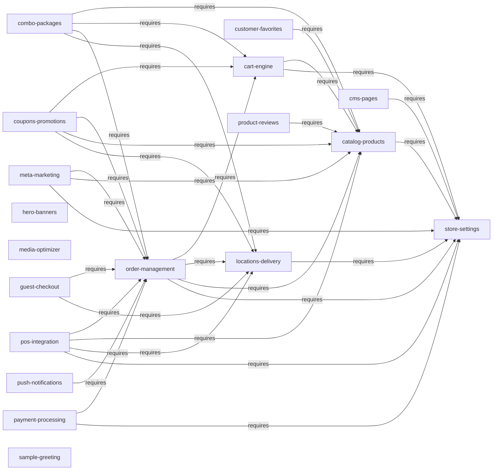
```mermaid
flowchart LR
  nab11a5b85813["cart-engine"]
  ne88af0372ce1["catalog-products"]
  n3e4c9ca9ee4a["cms-pages"]
  n8c0e3ec972fb["combo-packages"]
  n9fad43d5ce0f["coupons-promotions"]
  nbcf0acbde537["customer-favorites"]
  n3cc5cba5e8e9["guest-checkout"]
  n4ca653d39104["hero-banners"]
  nd27c4752ae6d["locations-delivery"]
  n73fe8a22954d["media-optimizer"]
  nc22cbc7b1336["meta-marketing"]
  n9559f343aaa6["order-management"]
  na845d06e54da["payment-processing"]
  n9d56c06044d9["pos-integration"]
  n3aada8ab486b["product-reviews"]
  n45767578abf9["push-notifications"]
  n48c0f9a3ef3b["sample-greeting"]
  nb81e769afaeb["store-settings"]
  nab11a5b85813 -->|requires| ne88af0372ce1
  nab11a5b85813 -->|requires| nb81e769afaeb
  ne88af0372ce1 -->|requires| nb81e769afaeb
  n3e4c9ca9ee4a -->|requires| nb81e769afaeb
  n8c0e3ec972fb -->|requires| ne88af0372ce1
  n8c0e3ec972fb -->|requires| nab11a5b85813
  n8c0e3ec972fb -->|requires| n9559f343aaa6
  n8c0e3ec972fb -->|requires| nd27c4752ae6d
  n9fad43d5ce0f -->|requires| nab11a5b85813
  n9fad43d5ce0f -->|requires| n9559f343aaa6
  n9fad43d5ce0f -->|requires| ne88af0372ce1
  n9fad43d5ce0f -->|requires| nd27c4752ae6d
  nbcf0acbde537 -->|requires| ne88af0372ce1
  n3cc5cba5e8e9 -->|requires| n9559f343aaa6
  n3cc5cba5e8e9 -->|requires| nd27c4752ae6d
  nd27c4752ae6d -->|requires| nb81e769afaeb
  nc22cbc7b1336 -->|requires| n9559f343aaa6
  nc22cbc7b1336 -->|requires| ne88af0372ce1
  nc22cbc7b1336 -->|requires| nb81e769afaeb
  n9559f343aaa6 -->|requires| nab11a5b85813
  n9559f343aaa6 -->|requires| nd27c4752ae6d
  n9559f343aaa6 -->|requires| ne88af0372ce1
  n9559f343aaa6 -->|requires| nb81e769afaeb
  na845d06e54da -->|requires| n9559f343aaa6
  na845d06e54da -->|requires| nb81e769afaeb
  n9d56c06044d9 -->|requires| n9559f343aaa6
  n9d56c06044d9 -->|requires| ne88af0372ce1
  n9d56c06044d9 -->|requires| nd27c4752ae6d
  n9d56c06044d9 -->|requires| nb81e769afaeb
  n3aada8ab486b -->|requires| ne88af0372ce1
  n45767578abf9 -->|requires| n9559f343aaa6
```

### Central schema · Host

Migration-declared structure and FK links; not a live or replayed schema. Parent maximum is one; child minimum is zero. Circle markers indicate optional participation. Overlapping definitions and changes are listed below.


```mermaid
erDiagram
  n371fb0d3f2b0["bulk_notifications"] {
    string title
    text body
    json data
    string status
    json target_user_ids
    timestamp scheduled_at
    timestamp sent_at
    integer total_recipients
    integer successful_sends
    integer failed_sends
  }
  ne2614e13bcc9["cache"] {
    string key PK
    mediumText value
    integer expiration
  }
  n4653c65d3eaf["cache_locks"] {
    string key PK
    string owner
    integer expiration
  }
  na25fae6190c0["domains"] {
    increments id
    string domain
    string tenant_id
  }
  n614db57fd59f["tenants"]
  n614db57fd59f ||..o{ na25fae6190c0 : "tenant_id"
  n10e03e3533ec["failed_jobs"] {
    string uuid
    text connection
    text queue
    longText payload
    longText exception
    timestamp failed_at
  }
  n240d1f60e7bc["job_batches"] {
    string id PK
    string name
    integer total_jobs
    integer pending_jobs
    integer failed_jobs
    longText failed_job_ids
    mediumText options
    integer cancelled_at
    integer created_at
    integer finished_at
  }
  n36a798385832["jobs"] {
    string queue
    longText payload
    unsignedTinyInteger attempts
    unsignedInteger reserved_at
    unsignedInteger available_at
    unsignedInteger created_at
  }
  nd2812b0e159a["password_reset_tokens"] {
    string email PK
    string token
    timestamp created_at
  }
  ncc9719feea68["personal_access_tokens"] {
    text name
    string token
    text abilities
    timestamp last_used_at
    timestamp expires_at
  }
  n26b197d5a1bc["plugins"] {
    string id PK
    string name
    string version
    string category
    text description
    boolean is_core
    json dependencies
    string author
  }
  n5dfa0d2573bb["sessions"] {
    string id PK
    foreignId user_id
    string ip_address
    text user_agent
    longText payload
    integer last_activity
  }
  n22aef78bdd6b["tenant_plugins"] {
    string tenant_id
    string plugin_id
    string status
    json settings
    timestamp activated_at
    timestamp installed_at
  }
  n614db57fd59f["tenants"]
  n614db57fd59f ||..o{ n22aef78bdd6b : "tenant_id"
  n26b197d5a1bc["plugins"]
  n26b197d5a1bc ||..o{ n22aef78bdd6b : "plugin_id"
  n614db57fd59f["tenants"] {
    string id PK
    string admin_name
    string admin_email
    string admin_password
    json data
  }
  ne9ad7e8810f1["users"] {
    string name
    string email
    timestamp email_verified_at
    string password
    text app_authentication_secret
    text app_authentication_recovery_codes
  }
```

### Tenant schema · LocationsDelivery

Migration-declared structure and FK links; not a live or replayed schema. Parent maximum is one; child minimum is zero. Circle markers indicate optional participation. Overlapping definitions and changes are listed below.

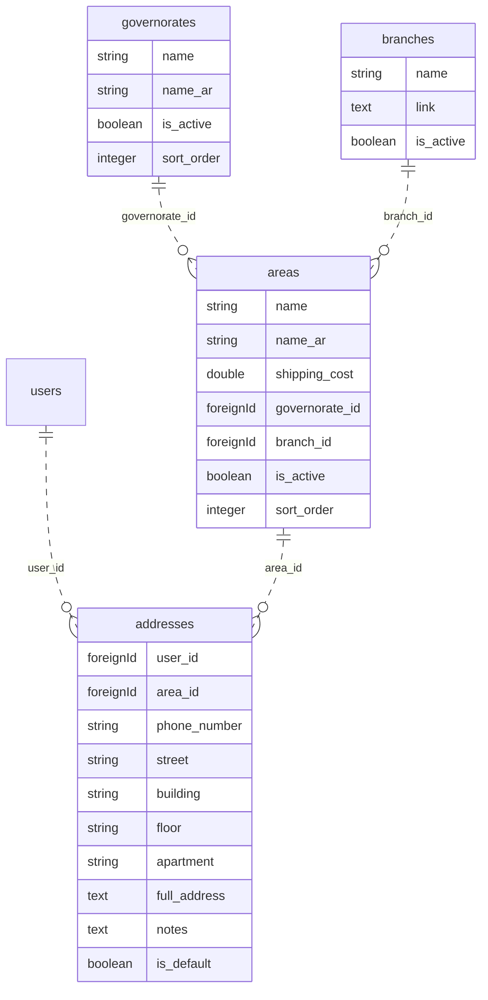
```mermaid
erDiagram
  n88cdee222611["addresses"] {
    foreignId user_id
    foreignId area_id
    string phone_number
    string street
    string building
    string floor
    string apartment
    text full_address
    text notes
    boolean is_default
  }
  n850e6885a4ad["users"]
  n850e6885a4ad ||..o{ n88cdee222611 : "user_id"
  n3e12e580b649["areas"]
  n3e12e580b649 ||..o{ n88cdee222611 : "area_id"
  n3e12e580b649["areas"] {
    string name
    string name_ar
    double shipping_cost
    foreignId governorate_id
    foreignId branch_id
    boolean is_active
    integer sort_order
  }
  nc9db09a1246f["governorates"]
  nc9db09a1246f ||..o{ n3e12e580b649 : "governorate_id"
  nf1e3efb0f08e["branches"]
  nf1e3efb0f08e ||..o{ n3e12e580b649 : "branch_id"
  nf1e3efb0f08e["branches"] {
    string name
    text link
    boolean is_active
  }
  nc9db09a1246f["governorates"] {
    string name
    string name_ar
    boolean is_active
    integer sort_order
  }
```

### Tenant schema · Host

Migration-declared structure and FK links; not a live or replayed schema. Parent maximum is one; child minimum is zero. Circle markers indicate optional participation. Overlapping definitions and changes are listed below.


```mermaid
erDiagram
  n88cdee222611["addresses"] {
    foreignId user_id
    foreignId area_id
    string phone_number
    string street
    string building
    string floor
    string apartment
    text full_address
    text notes
    boolean is_default
  }
  n850e6885a4ad["users"]
  n850e6885a4ad ||..o{ n88cdee222611 : "user_id"
  n3e12e580b649["areas"]
  n3e12e580b649 ||..o{ n88cdee222611 : "area_id"
  n3e12e580b649["areas"] {
    string name
    string name_ar
    double shipping_cost
    foreignId governorate_id
    foreignId branch_id
    boolean is_active
    integer sort_order
  }
  nc9db09a1246f["governorates"]
  nc9db09a1246f ||..o{ n3e12e580b649 : "governorate_id"
  nf1e3efb0f08e["branches"]
  nf1e3efb0f08e ||..o{ n3e12e580b649 : "branch_id"
  nf1e3efb0f08e["branches"] {
    string name
    text link
    boolean is_active
  }
  n83369e93dd94["cache"] {
    string key PK
    mediumText value
    integer expiration
  }
  n5e592cc7a397["cache_locks"] {
    string key PK
    string owner
    integer expiration
  }
  n02758cc02bf1["cart_item_extras"] {
    foreignId cart_item_id
    foreignId extra_option_item_id
    integer quantity
  }
  n48b1e09f13fe["cart_items"]
  n48b1e09f13fe ||..o{ n02758cc02bf1 : "cart_item_id"
  n5bd7fa5bd2cd["extra_option_items"]
  n5bd7fa5bd2cd ||..o{ n02758cc02bf1 : "extra_option_item_id"
  n48b1e09f13fe["cart_items"] {
    foreignId cart_id
    foreignId product_id
    foreignId variant_id
    decimal quantity
    foreignId weight_option_value_id
    integer weight_multiplier
  }
  nf3931be1c190["carts"]
  nf3931be1c190 ||..o{ n48b1e09f13fe : "cart_id"
  n12d52f1ad2fe["products"]
  n12d52f1ad2fe ||..o{ n48b1e09f13fe : "product_id"
  n7112e8f7884a["product_variants"]
  n7112e8f7884a |o..o{ n48b1e09f13fe : "variant_id"
  n4815cfc32520["weight_option_values"]
  n4815cfc32520 |o..o{ n48b1e09f13fe : "weight_option_value_id"
  nf3931be1c190["carts"] {
    foreignId user_id
    string session_id
    text note
    timestamp last_activity_at
  }
  n850e6885a4ad["users"]
  n850e6885a4ad |o..o{ nf3931be1c190 : "user_id"
  nd0f9b39cb853["categories"] {
    string name
    text description
    string image
    integer sort_order
    boolean is_active
    string name_ar
  }
  n5bd7fa5bd2cd["extra_option_items"] {
    foreignId extra_option_id
    string name
    double price
    boolean is_default
    integer sort_order
    string name_ar
  }
  n1e45139ba291["extra_options"]
  n1e45139ba291 ||..o{ n5bd7fa5bd2cd : "extra_option_id"
  n1e45139ba291["extra_options"] {
    string name
    text description
    boolean is_active
    integer min_selections
    integer max_selections
    boolean allow_multiple
    string name_ar
  }
  n1b7d26ee2a28["failed_jobs"] {
    string uuid
    text connection
    text queue
    longText payload
    longText exception
    timestamp failed_at
  }
  nc9db09a1246f["governorates"] {
    string name
    string name_ar
    boolean is_active
    integer sort_order
  }
  n7330ceac375b["job_batches"] {
    string id PK
    string name
    integer total_jobs
    integer pending_jobs
    integer failed_jobs
    longText failed_job_ids
    mediumText options
    integer cancelled_at
    integer created_at
    integer finished_at
  }
  n8822d874f713["jobs"] {
    string queue
    longText payload
    unsignedTinyInteger attempts
    unsignedInteger reserved_at
    unsignedInteger available_at
    unsignedInteger created_at
  }
  n4137ddaff8e9["notifications"] {
    uuid id PK
    string type
    text data
    timestamp read_at
  }
  na1aef1f03d01["password_reset_tokens"] {
    string email PK
    string token
    timestamp created_at
  }
  n7112e8f7884a["product_variants"] {
    foreignId product_id
    string name
    double price
    boolean is_available
    integer sort_order
    string name_ar
  }
  n12d52f1ad2fe["products"]
  n12d52f1ad2fe ||..o{ n7112e8f7884a : "product_id"
  n12d52f1ad2fe["products"] {
    string name
    text description
    string image
    double base_price
    double price_after_discount
    foreignId extra_option_id
    foreignId category_id
    boolean is_active
    boolean sell_by_weight
    foreignId weight_options_id
    string name_ar
  }
  n1e45139ba291["extra_options"]
  n1e45139ba291 |o..o{ n12d52f1ad2fe : "extra_option_id"
  nd0f9b39cb853["categories"]
  nd0f9b39cb853 ||..o{ n12d52f1ad2fe : "category_id"
  n3cf479df9a1b["weight_options"]
  n3cf479df9a1b |o..o{ n12d52f1ad2fe : "weight_options_id"
  nee5868a9dbc3["section_products"] {
    foreignId section_id
    foreignId product_id
    integer sort_order
  }
  n194a2682b2a8["sections"]
  n194a2682b2a8 ||..o{ nee5868a9dbc3 : "section_id"
  n12d52f1ad2fe["products"]
  n12d52f1ad2fe ||..o{ nee5868a9dbc3 : "product_id"
  n194a2682b2a8["sections"] {
    string title
    string location
    boolean is_active
    integer sort_order
    string title_ar
  }
  n2295a717560c["sessions"] {
    string id PK
    foreignId user_id
    string ip_address
    text user_agent
    longText payload
    integer last_activity
  }
  n4a3562ae93b4["settings"] {
    string key
    text value
  }
  n850e6885a4ad["users"] {
    string name
    string email
    timestamp email_verified_at
    boolean is_admin
    string password
    text app_authentication_secret
    text app_authentication_recovery_codes
    string google_id
    string avatar
  }
  n4815cfc32520["weight_option_values"] {
    foreignId weight_option_id
    decimal value
    string label
    integer sort_order
  }
  n3cf479df9a1b["weight_options"]
  n3cf479df9a1b ||..o{ n4815cfc32520 : "weight_option_id"
  n3cf479df9a1b["weight_options"] {
    string name
    string unit
  }
```

### Tenant schema · PosIntegration

Migration-declared structure and FK links; not a live or replayed schema. Parent maximum is one; child minimum is zero. Circle markers indicate optional participation. Overlapping definitions and changes are listed below.

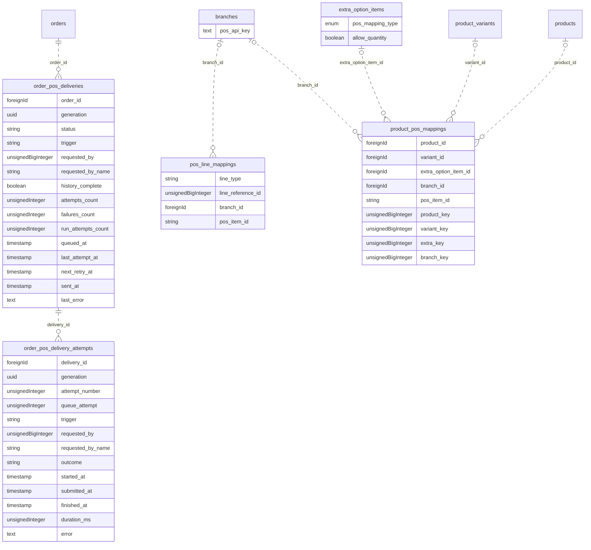
```mermaid
erDiagram
  nf1e3efb0f08e["branches"] {
    text pos_api_key
  }
  n5bd7fa5bd2cd["extra_option_items"] {
    enum pos_mapping_type
    boolean allow_quantity
  }
  n158cfc484e81["order_pos_deliveries"] {
    foreignId order_id
    uuid generation
    string status
    string trigger
    unsignedBigInteger requested_by
    string requested_by_name
    boolean history_complete
    unsignedInteger attempts_count
    unsignedInteger failures_count
    unsignedInteger run_attempts_count
    timestamp queued_at
    timestamp last_attempt_at
    timestamp next_retry_at
    timestamp sent_at
    text last_error
  }
  n0c3b5ea58ff8["orders"]
  n0c3b5ea58ff8 ||..o{ n158cfc484e81 : "order_id"
  n9ebe7d7bc912["order_pos_delivery_attempts"] {
    foreignId delivery_id
    uuid generation
    unsignedInteger attempt_number
    unsignedInteger queue_attempt
    string trigger
    unsignedBigInteger requested_by
    string requested_by_name
    string outcome
    timestamp started_at
    timestamp submitted_at
    timestamp finished_at
    unsignedInteger duration_ms
    text error
  }
  n158cfc484e81["order_pos_deliveries"]
  n158cfc484e81 ||..o{ n9ebe7d7bc912 : "delivery_id"
  n38c49504cbd8["pos_line_mappings"] {
    string line_type
    unsignedBigInteger line_reference_id
    foreignId branch_id
    string pos_item_id
  }
  nf1e3efb0f08e["branches"]
  nf1e3efb0f08e |o..o{ n38c49504cbd8 : "branch_id"
  n9ea7e4288c7e["product_pos_mappings"] {
    foreignId product_id
    foreignId variant_id
    foreignId extra_option_item_id
    foreignId branch_id
    string pos_item_id
    unsignedBigInteger product_key
    unsignedBigInteger variant_key
    unsignedBigInteger extra_key
    unsignedBigInteger branch_key
  }
  n12d52f1ad2fe["products"]
  n12d52f1ad2fe |o..o{ n9ea7e4288c7e : "product_id"
  n7112e8f7884a["product_variants"]
  n7112e8f7884a |o..o{ n9ea7e4288c7e : "variant_id"
  n5bd7fa5bd2cd["extra_option_items"]
  n5bd7fa5bd2cd |o..o{ n9ea7e4288c7e : "extra_option_item_id"
  nf1e3efb0f08e["branches"]
  nf1e3efb0f08e |o..o{ n9ea7e4288c7e : "branch_id"
```

### Tenant schema · PushNotifications

Migration-declared structure and FK links; not a live or replayed schema. Parent maximum is one; child minimum is zero. Circle markers indicate optional participation. Overlapping definitions and changes are listed below.

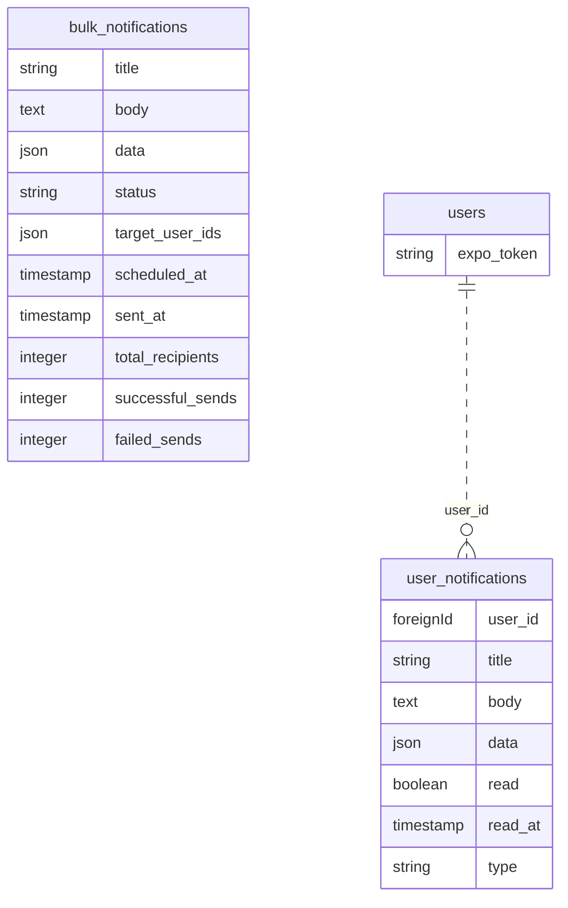
```mermaid
erDiagram
  n8d2fce18fabe["bulk_notifications"] {
    string title
    text body
    json data
    string status
    json target_user_ids
    timestamp scheduled_at
    timestamp sent_at
    integer total_recipients
    integer successful_sends
    integer failed_sends
  }
  ndf3303596636["user_notifications"] {
    foreignId user_id
    string title
    text body
    json data
    boolean read
    timestamp read_at
    string type
  }
  n850e6885a4ad["users"]
  n850e6885a4ad ||..o{ ndf3303596636 : "user_id"
  n850e6885a4ad["users"] {
    string expo_token
  }
```

### Tenant schema · CartEngine

Migration-declared structure and FK links; not a live or replayed schema. Parent maximum is one; child minimum is zero. Circle markers indicate optional participation. Overlapping definitions and changes are listed below.

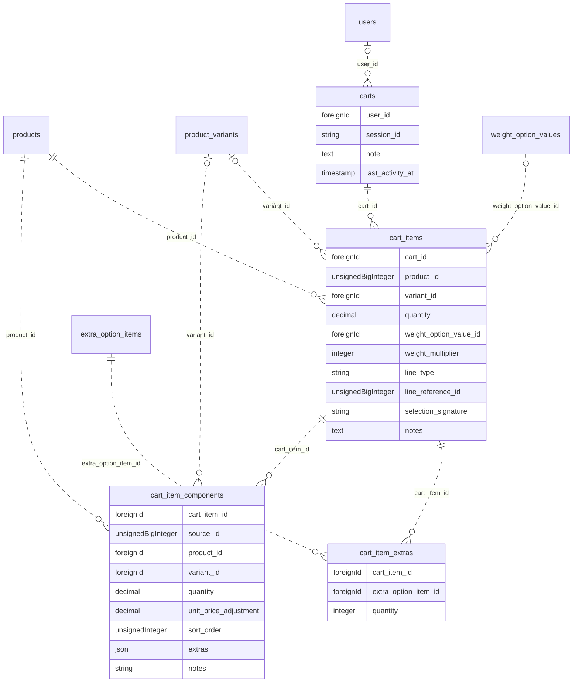
```mermaid
erDiagram
  n13f90cb45a7a["cart_item_components"] {
    foreignId cart_item_id
    unsignedBigInteger source_id
    foreignId product_id
    foreignId variant_id
    decimal quantity
    decimal unit_price_adjustment
    unsignedInteger sort_order
    json extras
    string notes
  }
  n48b1e09f13fe["cart_items"]
  n48b1e09f13fe ||..o{ n13f90cb45a7a : "cart_item_id"
  n12d52f1ad2fe["products"]
  n12d52f1ad2fe ||..o{ n13f90cb45a7a : "product_id"
  n7112e8f7884a["product_variants"]
  n7112e8f7884a |o..o{ n13f90cb45a7a : "variant_id"
  n02758cc02bf1["cart_item_extras"] {
    foreignId cart_item_id
    foreignId extra_option_item_id
    integer quantity
  }
  n48b1e09f13fe["cart_items"]
  n48b1e09f13fe ||..o{ n02758cc02bf1 : "cart_item_id"
  n5bd7fa5bd2cd["extra_option_items"]
  n5bd7fa5bd2cd ||..o{ n02758cc02bf1 : "extra_option_item_id"
  n48b1e09f13fe["cart_items"] {
    foreignId cart_id
    unsignedBigInteger product_id
    foreignId variant_id
    decimal quantity
    foreignId weight_option_value_id
    integer weight_multiplier
    string line_type
    unsignedBigInteger line_reference_id
    string selection_signature
    text notes
  }
  nf3931be1c190["carts"]
  nf3931be1c190 ||..o{ n48b1e09f13fe : "cart_id"
  n12d52f1ad2fe["products"]
  n12d52f1ad2fe ||..o{ n48b1e09f13fe : "product_id"
  n7112e8f7884a["product_variants"]
  n7112e8f7884a |o..o{ n48b1e09f13fe : "variant_id"
  n4815cfc32520["weight_option_values"]
  n4815cfc32520 |o..o{ n48b1e09f13fe : "weight_option_value_id"
  nf3931be1c190["carts"] {
    foreignId user_id
    string session_id
    text note
    timestamp last_activity_at
  }
  n850e6885a4ad["users"]
  n850e6885a4ad |o..o{ nf3931be1c190 : "user_id"
```

### Tenant schema · CatalogProducts

Migration-declared structure and FK links; not a live or replayed schema. Parent maximum is one; child minimum is zero. Circle markers indicate optional participation. Overlapping definitions and changes are listed below.

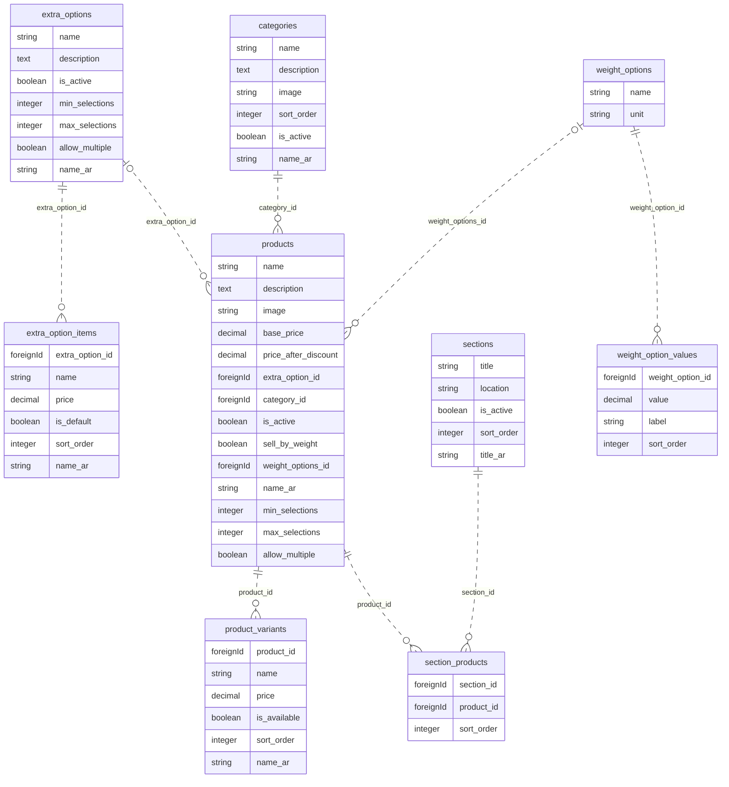
```mermaid
erDiagram
  nd0f9b39cb853["categories"] {
    string name
    text description
    string image
    integer sort_order
    boolean is_active
    string name_ar
  }
  n5bd7fa5bd2cd["extra_option_items"] {
    foreignId extra_option_id
    string name
    decimal price
    boolean is_default
    integer sort_order
    string name_ar
  }
  n1e45139ba291["extra_options"]
  n1e45139ba291 ||..o{ n5bd7fa5bd2cd : "extra_option_id"
  n1e45139ba291["extra_options"] {
    string name
    text description
    boolean is_active
    integer min_selections
    integer max_selections
    boolean allow_multiple
    string name_ar
  }
  n7112e8f7884a["product_variants"] {
    foreignId product_id
    string name
    decimal price
    boolean is_available
    integer sort_order
    string name_ar
  }
  n12d52f1ad2fe["products"]
  n12d52f1ad2fe ||..o{ n7112e8f7884a : "product_id"
  n12d52f1ad2fe["products"] {
    string name
    text description
    string image
    decimal base_price
    decimal price_after_discount
    foreignId extra_option_id
    foreignId category_id
    boolean is_active
    boolean sell_by_weight
    foreignId weight_options_id
    string name_ar
    integer min_selections
    integer max_selections
    boolean allow_multiple
  }
  n1e45139ba291["extra_options"]
  n1e45139ba291 |o..o{ n12d52f1ad2fe : "extra_option_id"
  nd0f9b39cb853["categories"]
  nd0f9b39cb853 ||..o{ n12d52f1ad2fe : "category_id"
  n3cf479df9a1b["weight_options"]
  n3cf479df9a1b |o..o{ n12d52f1ad2fe : "weight_options_id"
  nee5868a9dbc3["section_products"] {
    foreignId section_id
    foreignId product_id
    integer sort_order
  }
  n194a2682b2a8["sections"]
  n194a2682b2a8 ||..o{ nee5868a9dbc3 : "section_id"
  n12d52f1ad2fe["products"]
  n12d52f1ad2fe ||..o{ nee5868a9dbc3 : "product_id"
  n194a2682b2a8["sections"] {
    string title
    string location
    boolean is_active
    integer sort_order
    string title_ar
  }
  n4815cfc32520["weight_option_values"] {
    foreignId weight_option_id
    decimal value
    string label
    integer sort_order
  }
  n3cf479df9a1b["weight_options"]
  n3cf479df9a1b ||..o{ n4815cfc32520 : "weight_option_id"
  n3cf479df9a1b["weight_options"] {
    string name
    string unit
  }
```

### Tenant schema · CouponsPromotions

Migration-declared structure and FK links; not a live or replayed schema. Parent maximum is one; child minimum is zero. Circle markers indicate optional participation. Overlapping definitions and changes are listed below.

```mermaid
erDiagram
  n6c2342eb06df["coupons"] {
    string code
    enum type
    double value
    dateTime expiry_date
    boolean is_active
    integer max_usage
    integer usage_count
    double total_consumed
    json conditions
    text description
    string name
  }
```

### Tenant schema · GuestCheckout

Migration-declared structure and FK links; not a live or replayed schema. Parent maximum is one; child minimum is zero. Circle markers indicate optional participation. Overlapping definitions and changes are listed below.

```mermaid
erDiagram
  na934a1c28f6e["guest_users"] {
    string name
    string email
    string phone
    string phone_country_code
    string street
    string building
    string floor
    string apartment
    string city
    foreignId area_id
  }
  n3e12e580b649["areas"]
  n3e12e580b649 |o..o{ na934a1c28f6e : "area_id"
  n0c3b5ea58ff8["orders"] {
    foreignId user_id
    foreignId guest_user_id
  }
  na934a1c28f6e["guest_users"]
  na934a1c28f6e |o..o{ n0c3b5ea58ff8 : "guest_user_id"
```

### Tenant schema · HeroBanners

Migration-declared structure and FK links; not a live or replayed schema. Parent maximum is one; child minimum is zero. Circle markers indicate optional participation. Overlapping definitions and changes are listed below.

```mermaid
erDiagram
  n8a6943d28848["hero_sliders"] {
    string title
    string title_ar
    string subtitle
    string subtitle_ar
    string badge
    string badge_ar
    string cta_text
    string cta_text_ar
    string cta_link
    string secondary_cta_text
    string secondary_cta_text_ar
    string secondary_cta_link
    string image
    string gradient
    string icon
    integer sort_order
    boolean is_active
  }
```

### Tenant schema · MetaMarketing

Migration-declared structure and FK links; not a live or replayed schema. Parent maximum is one; child minimum is zero. Circle markers indicate optional participation. Overlapping definitions and changes are listed below.

```mermaid
erDiagram
  n3e752c009f2c["meta_capi_events"] {
    string event_name
    string event_id
    unsignedBigInteger order_id
    string status
    unsignedInteger attempts
    unsignedSmallInteger http_status
    string fbtrace_id
    unsignedInteger events_received
    text error
    json payload
    timestamp sent_at
  }
  ne20f37c2a26c["meta_order_tracking"] {
    unsignedBigInteger order_id
    string fbp
    string fbc
    string client_ip
    text user_agent
    text event_source_url
    string purchase_event_id
    timestamp purchase_sent_at
  }
```

### Tenant schema · OrderManagement

Migration-declared structure and FK links; not a live or replayed schema. Parent maximum is one; child minimum is zero. Circle markers indicate optional participation. Overlapping definitions and changes are listed below.

```mermaid
erDiagram
  na473e3f5c927["order_item_components"] {
    foreignId order_item_id
    unsignedBigInteger source_id
    string group_name
    string group_name_ar
    foreignId product_id
    foreignId variant_id
    string product_name
    string product_name_ar
    string variant_name
    string variant_name_ar
    decimal quantity
    decimal unit_price_adjustment
    unsignedInteger sort_order
    json extras
    string notes
  }
  nb84ef221a87a["order_items"]
  nb84ef221a87a ||..o{ na473e3f5c927 : "order_item_id"
  n12d52f1ad2fe["products"]
  n12d52f1ad2fe |o..o{ na473e3f5c927 : "product_id"
  n7112e8f7884a["product_variants"]
  n7112e8f7884a |o..o{ na473e3f5c927 : "variant_id"
  n80ce89ba2dd1["order_item_extras"] {
    foreignId order_item_id
    foreignId extra_option_item_id
    string extra_name
    decimal extra_price
    integer quantity
    string extra_name_ar
  }
  nb84ef221a87a["order_items"]
  nb84ef221a87a ||..o{ n80ce89ba2dd1 : "order_item_id"
  n5bd7fa5bd2cd["extra_option_items"]
  n5bd7fa5bd2cd |o..o{ n80ce89ba2dd1 : "extra_option_item_id"
  nb84ef221a87a["order_items"] {
    foreignId order_id
    unsignedBigInteger product_id
    foreignId variant_id
    string product_name
    string variant_name
    text notes
    decimal quantity
    decimal unit_price
    decimal total
    foreignId weight_option_value_id
    integer weight_multiplier
    string product_name_ar
    string variant_name_ar
    string weight_label
    decimal extras_unit_total
    string line_type
    unsignedBigInteger line_reference_id
  }
  n0c3b5ea58ff8["orders"]
  n0c3b5ea58ff8 ||..o{ nb84ef221a87a : "order_id"
  n12d52f1ad2fe["products"]
  n12d52f1ad2fe ||..o{ nb84ef221a87a : "product_id"
  n7112e8f7884a["product_variants"]
  n7112e8f7884a |o..o{ nb84ef221a87a : "variant_id"
  n4815cfc32520["weight_option_values"]
  n4815cfc32520 |o..o{ nb84ef221a87a : "weight_option_value_id"
  nc8ee05f6cfa4["order_status_events"] {
    foreignId order_id
    string from_status
    string to_status
    string source
    string ip
    timestamp created_at
  }
  n0c3b5ea58ff8["orders"]
  n0c3b5ea58ff8 ||..o{ nc8ee05f6cfa4 : "order_id"
  n0c3b5ea58ff8["orders"] {
    string order_number
    unsignedInteger shift_id
    string status
    string type
    decimal sub_total
    decimal tax
    decimal service
    decimal delivery_fee
    decimal discount
    decimal total
    text note
    unsignedBigInteger user_id
    unsignedBigInteger coupon_id
    foreignId branch_id
    foreignId address_id
    string pos_status
    text pos_failure_reason
    string customer_name
    string customer_phone
    json delivery_address
    string coupon_code
    string customer_email
  }
  n850e6885a4ad["users"]
  n850e6885a4ad ||..o{ n0c3b5ea58ff8 : "user_id"
  nf1e3efb0f08e["branches"]
  nf1e3efb0f08e ||..o{ n0c3b5ea58ff8 : "branch_id"
  n88cdee222611["addresses"]
  n88cdee222611 |o..o{ n0c3b5ea58ff8 : "address_id"
```

### Tenant schema · PaymentProcessing

Migration-declared structure and FK links; not a live or replayed schema. Parent maximum is one; child minimum is zero. Circle markers indicate optional participation. Overlapping definitions and changes are listed below.

```mermaid
erDiagram
  n0c3b5ea58ff8["orders"] {
    string merchant_order_id
    string transaction_id
    string paymob_order_id
    enum payment_status
    string payment_method
    text payment_data
  }
  n29ce68cfbee9["payment_events"] {
    string gateway
    string transaction_id
    string merchant_order_id
    string event_type
    unsignedBigInteger amount_cents
    string result
    timestamp created_at
  }
```

### Tenant schema · ComboPackages

Migration-declared structure and FK links; not a live or replayed schema. Parent maximum is one; child minimum is zero. Circle markers indicate optional participation. Overlapping definitions and changes are listed below.

```mermaid
erDiagram
  ndf929885efdf["package_availabilities"] {
    foreignId package_id
    unsignedTinyInteger day_of_week
    time starts_at
    time ends_at
  }
  nea5085a85672["packages"]
  nea5085a85672 ||..o{ ndf929885efdf : "package_id"
  n8e6e46546468["package_branch"] {
    foreignId package_id
    foreignId branch_id
  }
  nea5085a85672["packages"]
  nea5085a85672 ||..o{ n8e6e46546468 : "package_id"
  nf1e3efb0f08e["branches"]
  nf1e3efb0f08e ||..o{ n8e6e46546468 : "branch_id"
  n6147d1a6744d["package_groups"] {
    foreignId package_id
    string name
    string name_ar
    enum selection_type
    integer max_selections
    integer min_selections
    integer sort_order
    boolean allow_repeats
    text description
    text description_ar
  }
  nea5085a85672["packages"]
  nea5085a85672 ||..o{ n6147d1a6744d : "package_id"
  n38b1f413f5f8["package_items"] {
    foreignId package_group_id
    foreignId product_id
    foreignId variant_id
    integer quantity
    decimal price_adjustment
    boolean is_default
    integer sort_order
    string variant_mode
    boolean allow_extras
  }
  n6147d1a6744d["package_groups"]
  n6147d1a6744d ||..o{ n38b1f413f5f8 : "package_group_id"
  n12d52f1ad2fe["products"]
  n12d52f1ad2fe ||..o{ n38b1f413f5f8 : "product_id"
  n7112e8f7884a["product_variants"]
  n7112e8f7884a |o..o{ n38b1f413f5f8 : "variant_id"
  nf369f23cea34["package_product"] {
    foreignId package_id
    foreignId product_id
    integer quantity
  }
  nea5085a85672["packages"]
  nea5085a85672 ||..o{ nf369f23cea34 : "package_id"
  n12d52f1ad2fe["products"]
  n12d52f1ad2fe ||..o{ nf369f23cea34 : "product_id"
  nea5085a85672["packages"] {
    string name
    string name_ar
    text description
    text description_ar
    decimal price
    decimal original_price
    integer discount_percentage
    string badge
    string badge_ar
    string icon
    string gradient
    boolean is_active
    boolean is_featured
    integer sort_order
    timestamp valid_from
    timestamp valid_until
    string image
    boolean allow_coupons
    json allowed_order_types
    unsignedInteger max_per_order
    unsignedInteger daily_limit
  }
```

### Tenant schema · CmsPages

Migration-declared structure and FK links; not a live or replayed schema. Parent maximum is one; child minimum is zero. Circle markers indicate optional participation. Overlapping definitions and changes are listed below.

```mermaid
erDiagram
  n96c68830277f["pages"] {
    string title
    string slug
    longText content
    boolean is_active
    string title_ar
    longText content_ar
  }
```

### Tenant schema · ProductReviews

Migration-declared structure and FK links; not a live or replayed schema. Parent maximum is one; child minimum is zero. Circle markers indicate optional participation. Overlapping definitions and changes are listed below.

```mermaid
erDiagram
  n4d87991fba90["reviews"] {
    foreignId user_id
    foreignId product_id
    string guest_name
    string guest_email
    integer rating
    text comment
    json images
    boolean is_published
    boolean is_approved
  }
  n850e6885a4ad["users"]
  n850e6885a4ad |o..o{ n4d87991fba90 : "user_id"
  n12d52f1ad2fe["products"]
  n12d52f1ad2fe ||..o{ n4d87991fba90 : "product_id"
```

### Tenant schema · SampleGreeting

Migration-declared structure and FK links; not a live or replayed schema. Parent maximum is one; child minimum is zero. Circle markers indicate optional participation. Overlapping definitions and changes are listed below.

```mermaid
erDiagram
  n979f6972b8d4["sample_greetings"] {
    string message
  }
```

### Tenant schema · StoreSettings

Migration-declared structure and FK links; not a live or replayed schema. Parent maximum is one; child minimum is zero. Circle markers indicate optional participation. Overlapping definitions and changes are listed below.

```mermaid
erDiagram
  n4a3562ae93b4["settings"] {
    string key
    text value
  }
```

### Routes · cart-engine

Registered routes and handlers. Full middleware order, exclusions, and source references are in the route inventory.

```mermaid
flowchart LR
  B["HTTP request"]
  B --> n4eabd2eca0ae["DELETE /api/cart"]
  n4eabd2eca0ae -->|"cart-engine"| n1b06a5edd389["CartEngineApiController@clear"]
  B --> n674d8fe36340["GET|HEAD /api/cart"]
  n674d8fe36340 -->|"cart-engine"| n069e8a55715b["CartEngineApiController@index"]
  B --> nf1069bf25eb9["POST /api/cart/items"]
  nf1069bf25eb9 -->|"cart-engine"| nff194c603751["CartEngineApiController@store"]
  B --> ne094016ecb5a["DELETE /api/cart/items/{itemId}"]
  ne094016ecb5a -->|"cart-engine"| nf1f42033621c["CartEngineApiController@destroy"]
  B --> n79850c77116b["PATCH /api/cart/items/{itemId}"]
  n79850c77116b -->|"cart-engine"| na62705f562cc["CartEngineApiController@update"]
  B --> nff3ded402b67["POST /api/cart/sync"]
  nff3ded402b67 -->|"cart-engine"| na7bbdaccdb3c["CartEngineApiController@sync"]
```

### Routes · catalog-products

Registered routes and handlers. Full middleware order, exclusions, and source references are in the route inventory.

```mermaid
flowchart LR
  B["HTTP request"]
  B --> n509b1b974475["GET|HEAD /api/catalog-products"]
  n509b1b974475 -->|"catalog-products"| n246687e0f6cb["CatalogProductsApiController@index"]
  B --> n01d1c7f3a604["GET|HEAD /api/catalog-products/by-ids"]
  n01d1c7f3a604 -->|"catalog-products"| nea2b7bd33b79["CatalogProductsApiController@byIds"]
  B --> n646a69176d77["GET|HEAD /api/catalog-products/categories"]
  n646a69176d77 -->|"catalog-products"| n1bdf45b6a41c["CatalogProductsApiController@categories"]
  B --> n5a032e8d15e6["GET|HEAD /api/catalog-products/sections"]
  n5a032e8d15e6 -->|"catalog-products"| n867a38870b3f["CatalogProductsApiController@sections"]
  B --> nb19463d28039["GET|HEAD /api/catalog-products/suggestions"]
  nb19463d28039 -->|"catalog-products"| n5a9f90f82764["CatalogProductsApiController@suggestions"]
  B --> nd871e42c0583["GET|HEAD /api/catalog-products/{id}"]
  nd871e42c0583 -->|"catalog-products"| na593dc3d23c3["CatalogProductsApiController@show"]
```

### Routes · cms-pages

Registered routes and handlers. Full middleware order, exclusions, and source references are in the route inventory.

```mermaid
flowchart LR
  B["HTTP request"]
  B --> n53d2f0aa3ae6["GET|HEAD /api/cms-pages"]
  n53d2f0aa3ae6 -->|"cms-pages"| n20f312511617["CmsPagesApiController@index"]
  B --> n22ab7e41b550["GET|HEAD /api/cms-pages/{slug}"]
  n22ab7e41b550 -->|"cms-pages"| n21fda0877c8a["CmsPagesApiController@show"]
```

### Routes · combo-packages

Registered routes and handlers. Full middleware order, exclusions, and source references are in the route inventory.

```mermaid
flowchart LR
  B["HTTP request"]
  B --> n49238d868ece["GET|HEAD /api/packages"]
  n49238d868ece -->|"combo-packages"| n82dbe00ee076["PackageApiController@index"]
  B --> nb48f138c3f88["GET|HEAD /api/packages/{id}"]
  nb48f138c3f88 -->|"combo-packages"| n9d1272a5a5dd["PackageApiController@show"]
```

### Routes · coupons-promotions

Registered routes and handlers. Full middleware order, exclusions, and source references are in the route inventory.

```mermaid
flowchart LR
  B["HTTP request"]
  B --> nb65f8a28eeef["POST /api/coupons/validate"]
  nb65f8a28eeef -->|"coupons-promotions"| nb9d40d90969c["CouponApiController@validate"]
```

### Routes · customer-favorites

Registered routes and handlers. Full middleware order, exclusions, and source references are in the route inventory.

```mermaid
flowchart LR
  B["HTTP request"]
  B --> n5c8fe2bbe88e["POST /api/customer-favorites"]
  n5c8fe2bbe88e -->|"customer-favorites"| n66daab9a1384["CustomerFavoritesApiController@store"]
  B --> n9865bbb547e4["GET|HEAD /api/customer-favorites"]
  n9865bbb547e4 -->|"customer-favorites"| n85a1abc62453["CustomerFavoritesApiController@index"]
  B --> n656ac8e0634e["POST /api/customer-favorites/sync"]
  n656ac8e0634e -->|"customer-favorites"| n4562109f24a8["CustomerFavoritesApiController@sync"]
```

### Routes · guest-checkout

Registered routes and handlers. Full middleware order, exclusions, and source references are in the route inventory.

```mermaid
flowchart LR
  B["HTTP request"]
  B --> n786b6e699580["GET|HEAD /api/guest-checkout"]
  n786b6e699580 -->|"guest-checkout"| n86aa37b4529e["GuestCheckoutApiController@index"]
  B --> n6da7d0c35ea1["POST /api/guest-checkout/track"]
  n6da7d0c35ea1 -->|"guest-checkout"| n2dd28f03a05c["GuestCheckoutApiController@track"]
  B --> n33e961455786["GET|HEAD /api/tenant/guest-checkout"]
  n33e961455786 -->|"guest-checkout"| n86aa37b4529e["GuestCheckoutApiController@index"]
  B --> nd37d536bedc1["POST /api/tenant/guest-checkout/track"]
  nd37d536bedc1 -->|"guest-checkout"| n2dd28f03a05c["GuestCheckoutApiController@track"]
```

### Routes · hero-banners

Registered routes and handlers. Full middleware order, exclusions, and source references are in the route inventory.

```mermaid
flowchart LR
  B["HTTP request"]
  B --> n984e0fc184a1["GET|HEAD /api/hero-banners"]
  n984e0fc184a1 -->|"hero-banners"| n771e3e0d56da["HeroBannersApiController@index"]
  B --> n2140502fd8bf["GET|HEAD /api/hero-sliders"]
  n2140502fd8bf -->|"hero-banners"| n771e3e0d56da["HeroBannersApiController@index"]
```

### Routes · locations-delivery

Registered routes and handlers. Full middleware order, exclusions, and source references are in the route inventory.

```mermaid
flowchart LR
  B["HTTP request"]
  B --> nff81e141613a["GET|HEAD /api/locations-delivery"]
  nff81e141613a -->|"locations-delivery"| n62f5cd65dbee["LocationsDeliveryApiController@index"]
  B --> n0eea8f4f50bf["POST /api/locations-delivery/addresses"]
  n0eea8f4f50bf -->|"locations-delivery"| na228dd132cd1["LocationsDeliveryApiController@storeAddress"]
  B --> n1464c8b590a6["GET|HEAD /api/locations-delivery/addresses"]
  n1464c8b590a6 -->|"locations-delivery"| n391efeab03e2["LocationsDeliveryApiController@addresses"]
  B --> ne537231efed7["DELETE /api/locations-delivery/addresses/{address}"]
  ne537231efed7 -->|"locations-delivery"| n3fa563f9ce5f["LocationsDeliveryApiController@destroyAddress"]
  B --> nbd3b944d682b["PUT|PATCH /api/locations-delivery/addresses/{address}"]
  nbd3b944d682b -->|"locations-delivery"| n5f3c7af3b73a["LocationsDeliveryApiController@updateAddress"]
  B --> na4be7f3a4b32["GET|HEAD /api/locations-delivery/branches"]
  na4be7f3a4b32 -->|"locations-delivery"| n8174f7d564d9["LocationsDeliveryApiController@branches"]
  B --> nd732c71c556f["GET|HEAD /api/locations-delivery/governorates"]
  nd732c71c556f -->|"locations-delivery"| ndd706803b4d6["LocationsDeliveryApiController@governorates"]
```

### Routes · meta-marketing

Registered routes and handlers. Full middleware order, exclusions, and source references are in the route inventory.

```mermaid
flowchart LR
  B["HTTP request"]
  B --> n057498ea77cc["POST /api/meta/events"]
  n057498ea77cc -->|"meta-marketing"| n28540cd4493c["RelayEventController"]
  B --> nca95eb167b89["GET|HEAD /meta/catalog/{token}.ar.csv"]
  nca95eb167b89 -->|"meta-marketing"| nf1d0b57cfd1b["CatalogFeedController@arabicOverride"]
  B --> nabeee3731977["GET|HEAD /meta/catalog/{token}.{format}"]
  nabeee3731977 -->|"meta-marketing"| n313d14e61485["CatalogFeedController@primary"]
```

### Routes · order-management

Registered routes and handlers. Full middleware order, exclusions, and source references are in the route inventory.

```mermaid
flowchart LR
  B["HTTP request"]
  B --> nfbf8419813c0["POST /api/order-status"]
  nfbf8419813c0 -->|"no route plugin gate"| nb1c42d2b358d["OrderStatusController@update"]
  B --> nfbef10492db4["GET|HEAD /api/orders"]
  nfbef10492db4 -->|"order-management"| n898585f51c7d["OrderController@index"]
  B --> n93579115d995["POST /api/orders/place"]
  n93579115d995 -->|"order-management"| n9082ab9e9309["OrderController@placeOrder"]
  B --> n23641327e316["GET|HEAD /api/orders/{orderId}"]
  n23641327e316 -->|"order-management"| nfeed20a8e38d["OrderController@show"]
```

### Routes · payment-processing

Registered routes and handlers. Full middleware order, exclusions, and source references are in the route inventory.

```mermaid
flowchart LR
  B["HTTP request"]
  B --> n9e3d894dde92["GET|HEAD /api/orders/{orderId}/payment-status"]
  n9e3d894dde92 -->|"payment-processing"| n06b0809196ec["PaymentProcessingApiController@paymentStatus"]
  B --> n7435335a3402["GET|HEAD /api/payments/{order}/kashier-config"]
  n7435335a3402 -->|"payment-processing"| na80f9f68b8e8["PaymentProcessingApiController@kashierConfig"]
  B --> n6f0665deb779["POST /api/webhooks/kashier"]
  n6f0665deb779 -->|"no route plugin gate"| nd5add8f3872f["KashierWebhookController@handle"]
  B --> n8d5e2c11ca73["POST /api/webhooks/paymob"]
  n8d5e2c11ca73 -->|"no route plugin gate"| n3382a28c4bf1["PaymobWebhookController@handle"]
  B --> na1b5fda96a9d["GET|HEAD /orders/{orderId}/payment/callback"]
  na1b5fda96a9d -->|"payment-processing"| n3b386361f319["PaymentController@paymentCallback"]
```

### Routes · product-reviews

Registered routes and handlers. Full middleware order, exclusions, and source references are in the route inventory.

```mermaid
flowchart LR
  B["HTTP request"]
  B --> n549f203122ef["POST /api/products/{product}/reviews"]
  n549f203122ef -->|"product-reviews"| n4d54f8a56367["ProductReviewsApiController@store"]
  B --> nc75245e3cc6c["GET|HEAD /api/products/{product}/reviews"]
  nc75245e3cc6c -->|"product-reviews"| n2f702f8384cc["ProductReviewsApiController@index"]
```

### Routes · push-notifications

Registered routes and handlers. Full middleware order, exclusions, and source references are in the route inventory.

```mermaid
flowchart LR
  B["HTTP request"]
  B --> n4ea951d76d53["GET|HEAD /api/notifications"]
  n4ea951d76d53 -->|"push-notifications"| n793485333213["NotificationController@index"]
  B --> n0e19f055d5eb["POST /api/notifications/clear-read"]
  n0e19f055d5eb -->|"push-notifications"| nb403b724264f["NotificationController@clearRead"]
  B --> n33b9db02c67a["POST /api/notifications/mark-all-as-read"]
  n33b9db02c67a -->|"push-notifications"| n02960d26c688["NotificationController@markAllAsRead"]
  B --> ne8866709af8d["GET|HEAD /api/notifications/unread-count"]
  ne8866709af8d -->|"push-notifications"| n75fc4e71a6d1["NotificationController@unreadCount"]
  B --> n2c8581561525["DELETE /api/notifications/{id}"]
  n2c8581561525 -->|"push-notifications"| n0c684e4c8e3f["NotificationController@destroy"]
  B --> n66a09c616fca["POST /api/notifications/{id}/mark-as-read"]
  n66a09c616fca -->|"push-notifications"| nd66d5225e6db["NotificationController@markAsRead"]
```

## Coverage

- No authenticated browser or tenant request was executed.
- No deployed topology, runtime plugin activation, tenant data, or live schema was verified.
- Column shorthands remain labeled; raw SQL, schema macros, connection chains, and dynamic table names require review.
- Migration histories are not replayed: declarations may overlap, change, or remove columns and constraints.
- Static class references show source dependencies, not actual runtime calls.
- Middleware inventory is route-level; framework global middleware requires source review.
