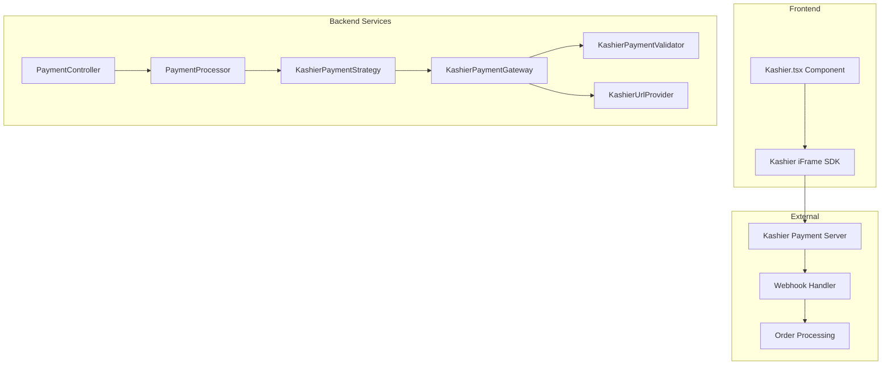

# Kashier Payment Gateway Integration

A comprehensive guide to integrating Kashier payment gateway in Laravel applications using SOLID principles and clean architecture patterns.

## Table of Contents

- [Overview](#overview)
- [Features](#features)
- [Architecture](#architecture)
- [Installation](#installation)
- [Configuration](#configuration)
- [Implementation](#implementation)
  - [Data Transfer Objects](#data-transfer-objects)
  - [Interfaces](#interfaces)
  - [Payment Gateway](#payment-gateway)
  - [Payment Strategy](#payment-strategy)
  - [URL Provider](#url-provider)
  - [Payment Validator](#payment-validator)
  - [Service Provider Registration](#service-provider-registration)
  - [Frontend Component](#frontend-component)
  - [Routes](#routes)
- [Hash Generation](#hash-generation)
- [Webhook Handling](#webhook-handling)
- [Refund Processing](#refund-processing)
- [Testing](#testing)
- [API Reference](#api-reference)
- [Troubleshooting](#troubleshooting)

---

## Overview

Kashier is an Egyptian payment gateway that supports multiple payment methods including credit cards and mobile wallets. This documentation covers a complete, production-ready implementation following SOLID principles and the Strategy pattern for easy extensibility.

### Key Concepts

| Concept | Description |
|---------|-------------|
| **iFrame Checkout** | Kashier embeds a secure payment form via JavaScript SDK |
| **Hash Verification** | HMAC-SHA256 signatures for request/response validation |
| **Webhook Notifications** | Server-to-server payment confirmation |
| **Redirect URLs** | Customer redirection after payment success/failure |

---

## Features

- ✅ Credit card payments
- ✅ Mobile wallet payments
- ✅ Webhook signature validation
- ✅ Automated refund processing via API
- ✅ Test/Live mode switching
- ✅ SOLID architecture (extensible and testable)

---

## Architecture



### Design Patterns Used

| Pattern | Purpose |
|---------|---------|
| **Strategy** | Allows switching between payment gateways (Kashier, Paymob, etc.) |
| **Template Method** | Common payment flow in `AbstractPaymentGateway` |
| **Dependency Injection** | Loose coupling via interfaces |
| **Data Transfer Object** | Clean data encapsulation for payment params |

---

## Installation

### 1. Required Environment Variables

Add the following to your `.env` file:

```env
KASHIER_MERCHANT_ID=your_merchant_id
KASHIER_API_KEY=your_api_key
KASHIER_SECRET_KEY=your_secret_key
KASHIER_MODE=test  # or 'live' for production
```

### 2. Configuration File

Add Kashier configuration to `config/services.php`:

```php
'kashier' => [
    'merchant_id' => env('KASHIER_MERCHANT_ID'),
    'api_key' => env('KASHIER_API_KEY'),
    'secret_key' => env('KASHIER_SECRET_KEY'),
    'mode' => env('KASHIER_MODE', 'test'),
],
```

---

## Configuration

### API Endpoints

| Environment | Base URL |
|-------------|----------|
| **Test** | `https://test-api.kashier.io` |
| **Live** | `https://api.kashier.io` |

### Payment Form Endpoints

| Environment | iFrame URL |
|-------------|------------|
| **Test** | `https://payments.kashier.io/kashier-checkout.js` |
| **Live** | Same URL (mode determines behavior) |

### Refund API Endpoints

| Environment | Refund URL |
|-------------|------------|
| **Test** | `https://test-fep.kashier.io/v3/orders/{orderId}/` |
| **Live** | `https://fep.kashier.io/v3/orders/{orderId}/` |

---

## Implementation

### Data Transfer Objects

#### PaymentResultData (Base DTO)

```php
<?php

namespace App\DTOs;

class PaymentResultData
{
    public function __construct(
        public readonly string $merchantId,
        public readonly string $orderId,
        public readonly string $amount,
        public readonly string $currency,
        public readonly string $hash,
        public readonly string $mode,
        public readonly string $redirectUrl,
        public readonly string $failureUrl,
        public readonly string $webhookUrl,
        public readonly ?array $additionalParams = null,
    ) {}

    public function toArray(): array
    {
        return [
            'merchantId' => $this->merchantId,
            'orderId' => $this->orderId,
            'amount' => $this->amount,
            'currency' => $this->currency,
            'hash' => $this->hash,
            'mode' => $this->mode,
            'redirectUrl' => $this->redirectUrl,
            'failureUrl' => $this->failureUrl,
            'webhookUrl' => $this->webhookUrl,
            'additionalParams' => $this->additionalParams,
        ];
    }
}
```

#### KashierPaymentData (Extended DTO)

```php
<?php

namespace App\DTOs;

class KashierPaymentData extends PaymentResultData
{
    /**
     * @param string $merchantId     The Kashier merchant ID
     * @param string $orderId        The order reference ID
     * @param string $amount         The payment amount
     * @param string $currency       The payment currency (e.g., 'EGP')
     * @param string $hash           The HMAC-SHA256 hash for validation
     * @param string $mode           The payment mode ('test' or 'live')
     * @param string $redirectUrl    The URL to redirect to after payment
     * @param string $failureUrl     The URL to redirect to on payment failure
     * @param string $webhookUrl     The URL for payment gateway webhooks
     * @param string $displayMode    The language for display ('ar' or 'en')
     * @param string $paymentRequestId  Unique request ID for the payment
     * @param string $allowedMethods Allowed payment methods ('card', 'wallet', etc.)
     */
    public function __construct(
        string $merchantId,
        string $orderId,
        string $amount,
        string $currency,
        string $hash,
        string $mode,
        string $redirectUrl,
        string $failureUrl,
        string $webhookUrl,
        public readonly string $displayMode = 'ar',
        public readonly string $paymentRequestId = '',
        public readonly string $allowedMethods = 'card',
        ?array $additionalParams = null,
    ) {
        parent::__construct(
            $merchantId,
            $orderId,
            $amount,
            $currency,
            $hash,
            $mode,
            $redirectUrl,
            $failureUrl,
            $webhookUrl,
            $additionalParams,
        );
    }

    public function toArray(): array
    {
        return [
            'merchantId' => $this->merchantId,
            'orderId' => $this->orderId,
            'amount' => $this->amount,
            'currency' => $this->currency,
            'hash' => $this->hash,
            'mode' => $this->mode,
            'merchantRedirect' => $this->redirectUrl,
            'failureRedirect' => $this->failureUrl,
            'serverWebhook' => $this->webhookUrl,
            'displayMode' => $this->displayMode,
            'paymentRequestId' => $this->paymentRequestId,
            'allowedMethods' => $this->allowedMethods,
        ];
    }
}
```

---

### Interfaces

#### PaymentGatewayInterface

```php
<?php

namespace App\Interfaces;

use App\DTOs\PaymentResultData;
use App\DTOs\RefundRequestData;
use App\DTOs\RefundResultData;
use App\Models\Order;

interface PaymentGatewayInterface
{
    /**
     * Initialize payment for an order
     */
    public function initializePayment(Order $order): PaymentResultData;

    /**
     * Process a successful payment for an order
     */
    public function processSuccessfulPayment(Order $order, array $paymentData): Order;

    /**
     * Process a refund for an order
     */
    public function processRefund(RefundRequestData $refundRequest): RefundResultData;

    /**
     * Get the gateway identifier
     */
    public function getGatewayId(): string;

    /**
     * Check if the gateway supports a specific feature
     */
    public function supports(string $feature): bool;
}
```

#### PaymentValidatorInterface

```php
<?php

namespace App\Interfaces;

interface PaymentValidatorInterface
{
    /**
     * Validate payment response from the payment gateway
     */
    public function validatePaymentResponse(array $params): bool;

    /**
     * Validate payment response from the payment gateway (webhook version)
     */
    public function validateWebhookPayload(
        string $rawPayload, 
        array $headers, 
        array $queryParams = []
    ): bool;
}
```

#### PaymentUrlProviderInterface

```php
<?php

namespace App\Interfaces;

use App\Models\Order;

interface PaymentUrlProviderInterface
{
    /**
     * Get the success redirect URL for the payment
     */
    public function getSuccessRedirectUrl(Order $order): string;

    /**
     * Get the failure redirect URL for the payment
     */
    public function getFailureRedirectUrl(Order $order): string;

    /**
     * Get the webhook URL for the payment gateway
     */
    public function getWebhookUrl(): string;
}
```

---

### Payment Gateway

The core payment gateway class handles all Kashier-specific logic:

```php
<?php

namespace App\Services\Payment\Gateways;

use App\DTOs\KashierPaymentData;
use App\DTOs\PaymentResultData;
use App\DTOs\RefundRequestData;
use App\DTOs\RefundResultData;
use App\Interfaces\PaymentValidatorInterface;
use App\Interfaces\PaymentUrlProviderInterface;
use App\Models\Order;
use Illuminate\Support\Facades\Http;
use Illuminate\Support\Facades\Log;

class KashierPaymentGateway extends AbstractPaymentGateway
{
    protected string $merchantId;
    protected string $apiKey;
    protected string $mode;

    public function __construct(
        PaymentValidatorInterface $validator,
        PaymentUrlProviderInterface $urlProvider,
        ?string $merchantId = null,
        ?string $apiKey = null,
        ?string $mode = null
    ) {
        parent::__construct($validator, $urlProvider);
        $this->merchantId = $merchantId ?? config('services.kashier.merchant_id');
        $this->apiKey = $apiKey ?? config('services.kashier.api_key');
        $this->mode = $mode ?? config('services.kashier.mode', 'test');
    }

    public function getGatewayId(): string
    {
        return 'kashier';
    }

    /**
     * Check feature support for Kashier
     */
    public function supports(string $feature): bool
    {
        return match ($feature) {
            'refunds' => true,
            'webhooks' => true,
            'recurring' => false,
            'cards' => true,
            'wallets' => false,  // Adjust based on your account capabilities
            default => parent::supports($feature),
        };
    }

    /**
     * Create Kashier-specific payment data
     */
    protected function createPaymentData(Order $order): PaymentResultData
    {
        $uniqueRef = $this->generateOrderReference($order->id);
        $amount = number_format((float) $order->total, 2, '.', '');
        $currency = 'EGP';

        // Generate HMAC-SHA256 hash
        $path = "/?payment={$this->merchantId}.{$uniqueRef}.{$amount}.{$currency}";
        $hash = hash_hmac('sha256', $path, $this->apiKey);

        $redirectUrl = $this->urlProvider->getSuccessRedirectUrl($order);
        $failureUrl = $this->urlProvider->getFailureRedirectUrl($order);
        $webhookUrl = $this->urlProvider->getWebhookUrl();

        Log::info('Kashier Payment Data Generated', [
            'merchant_id' => $this->merchantId,
            'order_id' => $uniqueRef,
            'amount' => $amount,
            'currency' => $currency,
            'mode' => $this->mode,
        ]);

        // Determine allowed methods based on order payment method
        $allowedMethods = match ($order->payment_method) {
            PaymentMethod::CREDIT_CARD => 'card',
            PaymentMethod::WALLET => 'wallet',
            default => 'card',
        };

        return new KashierPaymentData(
            merchantId: $this->merchantId,
            orderId: $uniqueRef,
            amount: $amount,
            currency: $currency,
            hash: $hash,
            mode: $this->mode,
            redirectUrl: $redirectUrl,
            failureUrl: $failureUrl,
            webhookUrl: $webhookUrl,
            displayMode: 'ar',
            paymentRequestId: uniqid('pr_'),
            allowedMethods: $allowedMethods,
            additionalParams: [
                'orderId' => $order->id,
            ]
        );
    }

    /**
     * Generate a unique order reference for Kashier
     */
    protected function generateOrderReference(int $orderId): string
    {
        // Example: ORD-1234-20240120-ABC123
        return sprintf(
            'ORD-%d-%s-%s',
            $orderId,
            date('Ymd'),
            strtoupper(substr(uniqid(), -6))
        );
    }

    /**
     * Execute refund through Kashier API
     */
    protected function executeRefund(RefundRequestData $refundRequest): RefundResultData
    {
        $baseUrl = $this->getApiBaseUrl();
        $secretKey = config('services.kashier.secret_key');
        $merchantOrderId = $this->generateOrderReference($refundRequest->orderId);

        $url = $baseUrl === 'https://api.kashier.io'
            ? "https://fep.kashier.io/v3/orders/{$merchantOrderId}/"
            : "https://test-fep.kashier.io/v3/orders/{$merchantOrderId}/";

        $payload = [
            'apiOperation' => 'REFUND',
            'reason' => $refundRequest->reason ?? 'Order return refund',
            'transaction' => [
                'amount' => (float) number_format($refundRequest->amount, 2, '.', ''),
            ],
        ];

        try {
            $response = Http::withHeaders([
                'Authorization' => $secretKey,
                'accept' => 'application/json',
                'Content-Type' => 'application/json',
            ])
                ->withOptions([
                    'verify' => config('app.env') === 'production',
                ])
                ->put($url, $payload);

            $responseData = $response->json();

            if (
                $response->successful() &&
                ($responseData['status'] ?? null) === 'SUCCESS' &&
                ($responseData['response']['status'] ?? null) === 'REFUNDED'
            ) {
                Log::info('Kashier refund successful', [
                    'order_id' => $refundRequest->orderId,
                    'amount' => $refundRequest->amount,
                    'transaction_id' => $responseData['response']['transactionId'] ?? null,
                ]);

                return RefundResultData::success($responseData);
            }

            Log::error('Kashier refund failed', $responseData);
            return RefundResultData::failure($responseData);

        } catch (\Exception $e) {
            Log::error('Kashier refund API call failed', [
                'exception' => $e->getMessage(),
            ]);
            return RefundResultData::exception($e->getMessage());
        }
    }

    public function getApiBaseUrl(): string
    {
        return $this->mode === 'live'
            ? 'https://api.kashier.io'
            : 'https://test-api.kashier.io';
    }
}
```

---

### Payment Strategy

The strategy pattern enables flexible payment method switching:

```php
<?php

namespace App\Services\Payment\Strategies;

use App\Enums\PaymentMethod;
use App\Interfaces\PaymentGatewayInterface;
use App\Models\Order;

class KashierPaymentStrategy extends AbstractOnlinePaymentStrategy
{
    public function __construct(PaymentGatewayInterface $gateway)
    {
        parent::__construct($gateway);
    }

    /**
     * Check if this strategy can handle the given order
     */
    public function canHandle(Order $order): bool
    {
        return $order->payment_method === PaymentMethod::CREDIT_CARD
            || $order->payment_method === PaymentMethod::WALLET;
    }

    public function getPaymentMethod(): string
    {
        return 'kashier';
    }

    protected function getPaymentMethodEnum(): PaymentMethod
    {
        return PaymentMethod::CREDIT_CARD;
    }

    /**
     * Override validateOrder to handle multiple payment methods
     */
    protected function validateOrder(Order $order): void
    {
        if ($order->payment_status->isPaid()) {
            throw new \InvalidArgumentException('Order has already been paid');
        }

        if (! $this->canHandle($order)) {
            throw new \InvalidArgumentException(
                "Order payment method {$order->payment_method->value} is not supported"
            );
        }
    }
}
```

---

### URL Provider

Generates Kashier-specific callback URLs:

```php
<?php

namespace App\Services\Payment\UrlProviders;

use App\Interfaces\PaymentUrlProviderInterface;
use App\Models\Order;

class KashierUrlProvider implements PaymentUrlProviderInterface
{
    public function getSuccessRedirectUrl(Order $order): string
    {
        return route('kashier.payment.success', ['order' => $order->id]);
    }

    public function getFailureRedirectUrl(Order $order): string
    {
        return route('kashier.payment.failure', ['order' => $order->id]);
    }

    public function getWebhookUrl(): string
    {
        return config('app.url') . '/webhooks/kashier';
    }
}
```

---

### Payment Validator

Handles signature verification for all Kashier responses:

```php
<?php

namespace App\Services\Payment\Validators;

use App\Interfaces\PaymentValidatorInterface;
use Illuminate\Support\Facades\Log;

class KashierPaymentValidator implements PaymentValidatorInterface
{
    protected string $apiKey;

    public function __construct(?string $apiKey = null)
    {
        $this->apiKey = $apiKey ?? config('services.kashier.api_key');
    }

    /**
     * Validate the payment response from Kashier
     */
    public function validatePaymentResponse(array $params): bool
    {
        Log::info('Validating payment response', ['params' => $params]);

        // For webhook data (already validated in webhook handler)
        if (isset($params['status'], $params['transactionId'], $params['merchantOrderId'])) {
            return $this->validateWebhookResponseData($params);
        }

        // For URL redirect parameters - rely on webhook for verification
        if (isset($params['merchantOrderId']) || isset($params['orderReference'])) {
            return true;
        }

        // For responses with signature
        if (! isset($params['signature'])) {
            Log::warning('No signature found in payment response');
            return false;
        }

        $receivedSignature = $params['signature'];
        $queryString = '';

        foreach ($params as $key => $value) {
            if ($key === 'signature' || $key === 'mode') {
                continue;
            }
            $queryString .= "&{$key}={$value}";
        }

        $queryString = ltrim($queryString, '&');
        $expectedSignature = hash_hmac('sha256', $queryString, $this->apiKey);

        return hash_equals($expectedSignature, $receivedSignature);
    }

    private function validateWebhookResponseData(array $data): bool
    {
        $requiredFields = ['status', 'merchantOrderId', 'transactionId'];

        foreach ($requiredFields as $field) {
            if (! isset($data[$field])) {
                return false;
            }
        }

        return true;
    }

    /**
     * Validate the webhook payload from Kashier
     */
    public function validateWebhookPayload(
        string $rawPayload, 
        array $headers, 
        array $queryParams = []
    ): bool {
        try {
            $jsonData = json_decode($rawPayload, true);

            if (! $jsonData || ! isset($jsonData['data'], $jsonData['event'])) {
                return false;
            }

            $dataObj = $jsonData['data'];

            if (! isset($dataObj['signatureKeys']) || ! is_array($dataObj['signatureKeys'])) {
                return false;
            }

            $signatureKeys = $dataObj['signatureKeys'];
            sort($signatureKeys);

            $headers = array_change_key_case($headers, CASE_LOWER);
            $kashierSignature = $headers['x-kashier-signature'] ?? null;

            if (is_array($kashierSignature)) {
                $kashierSignature = $kashierSignature[0] ?? null;
            }

            if (! $kashierSignature) {
                return false;
            }

            $data = [];
            foreach ($signatureKeys as $key) {
                if (isset($dataObj[$key])) {
                    $data[$key] = $dataObj[$key];
                }
            }

            $queryString = http_build_query($data, '', '&', PHP_QUERY_RFC3986);
            $expectedSignature = hash_hmac('sha256', $queryString, $this->apiKey, false);

            Log::info('Kashier webhook signature validation', [
                'query_string' => $queryString,
                'expected_signature' => $expectedSignature,
                'received_signature' => $kashierSignature,
            ]);

            return hash_equals($expectedSignature, $kashierSignature);

        } catch (\Exception $e) {
            Log::error('Error validating Kashier webhook signature', [
                'exception' => $e->getMessage(),
            ]);
            return false;
        }
    }
}
```

---

### Service Provider Registration

Register all services in `AppServiceProvider.php`:

```php
<?php

namespace App\Providers;

use Illuminate\Support\ServiceProvider;

class AppServiceProvider extends ServiceProvider
{
    public function register(): void
    {
        $this->registerPaymentServices();
    }

    private function registerPaymentServices(): void
    {
        // Bind Kashier-specific services
        $this->app->bind(
            'kashier.validator',
            \App\Services\Payment\Validators\KashierPaymentValidator::class
        );

        $this->app->bind(
            'kashier.urlProvider',
            \App\Services\Payment\UrlProviders\KashierUrlProvider::class
        );

        // Bind interfaces to implementations
        $this->app->bind(
            \App\Interfaces\PaymentValidatorInterface::class,
            \App\Services\Payment\Validators\KashierPaymentValidator::class
        );

        $this->app->bind(
            \App\Interfaces\PaymentUrlProviderInterface::class,
            \App\Services\Payment\UrlProviders\KashierUrlProvider::class
        );

        // Register Kashier gateway with its dependencies
        $this->app->bind(
            \App\Services\Payment\Gateways\KashierPaymentGateway::class,
            function ($app) {
                return new \App\Services\Payment\Gateways\KashierPaymentGateway(
                    $app->make('kashier.validator'),
                    $app->make('kashier.urlProvider')
                );
            }
        );

        // Register payment processor with Kashier strategy
        $this->app->singleton(
            \App\Services\Payment\PaymentProcessor::class, 
            function ($app) {
                $processor = new \App\Services\Payment\PaymentProcessor;

                $kashierGateway = $app->make(
                    \App\Services\Payment\Gateways\KashierPaymentGateway::class
                );
                $kashierStrategy = new \App\Services\Payment\Strategies\KashierPaymentStrategy(
                    $kashierGateway
                );
                $processor->addStrategy($kashierStrategy, 'kashier');

                return $processor;
            }
        );
    }
}
```

---

### Frontend Component

React/TypeScript component for rendering the Kashier payment form:

```tsx
import React, { useEffect, useRef } from 'react';
import { Head } from '@inertiajs/react';
import { Card } from '@/Components/ui/card';
import { Alert, AlertTitle, AlertDescription } from '@/Components/ui/alert';
import { AlertCircle } from 'lucide-react';

interface KashierParams {
    merchantId: string;
    orderId: string;
    amount: string;
    currency: string;
    hash: string;
    mode: string;
    merchantRedirect: string;
    serverWebhook: string;
    failureRedirect: string;
    allowedMethods: string;
    displayMode: string;
    paymentRequestId: string;
}

interface KashierProps {
    kashierParams: KashierParams;
}

export default function Kashier({ kashierParams }: KashierProps) {
    const iframeLoaded = useRef(false);

    useEffect(() => {
        // Load the Kashier checkout script
        const script = document.createElement('script');
        script.id = 'kashier-iFrame';
        script.src = 'https://payments.kashier.io/kashier-checkout.js';
        
        // Set data attributes for Kashier SDK
        script.setAttribute('data-amount', kashierParams.amount);
        script.setAttribute('data-hash', kashierParams.hash);
        script.setAttribute('data-currency', kashierParams.currency);
        script.setAttribute('data-orderid', kashierParams.orderId);
        script.setAttribute('data-merchantid', kashierParams.merchantId);
        script.setAttribute('data-merchantredirect', kashierParams.merchantRedirect);
        script.setAttribute('data-serverwebhook', kashierParams.serverWebhook);
        script.setAttribute('data-failureredirect', kashierParams.failureRedirect);
        script.setAttribute('data-mode', kashierParams.mode);
        script.setAttribute('data-display', kashierParams.displayMode);
        script.setAttribute('data-allowedmethods', kashierParams.allowedMethods);
        script.setAttribute('data-paymentrequestId', kashierParams.paymentRequestId);

        script.onload = () => {
            console.log('Kashier script loaded successfully');
            iframeLoaded.current = true;
        };

        script.onerror = () => {
            console.error('Failed to load Kashier script');
        };

        // Append to container
        document.getElementById('kashier-iFrame-container')!.appendChild(script);

        // Cleanup
        return () => {
            if (script.parentNode) {
                script.parentNode.removeChild(script);
            }
        };
    }, [kashierParams]);

    return (
        <div className="container mt-4">
            <Head title="Processing Payment" />

            <div className="space-y-6">
                <Card className="p-6 flex flex-col items-center justify-center min-h-[400px]">
                    <div className="text-center space-y-6">
                        <h2 className="text-xl font-medium">
                            Initializing Payment
                        </h2>
                        <p className="text-muted-foreground max-w-md">
                            Please wait while we connect to the secure payment gateway.
                            Do not close this page.
                        </p>

                        {/* Payment info */}
                        <div className="p-4 bg-muted rounded-lg mt-8">
                            <div className="grid grid-cols-2 gap-3 text-sm">
                                <div className="text-muted-foreground">Order Number:</div>
                                <div className="font-medium text-end">
                                    {kashierParams.orderId}
                                </div>

                                <div className="text-muted-foreground">Amount:</div>
                                <div className="font-medium text-end">
                                    {kashierParams.amount} {kashierParams.currency}
                                </div>
                            </div>
                        </div>

                        {/* Kashier iFrame container */}
                        <div id="kashier-iFrame-container"></div>
                    </div>
                </Card>

                <Alert>
                    <AlertCircle className="h-4 w-4" />
                    <AlertTitle>Having trouble with payment?</AlertTitle>
                    <AlertDescription>
                        If the payment window does not appear, please try refreshing
                        this page. For assistance, contact our support team.
                    </AlertDescription>
                </Alert>
            </div>
        </div>
    );
}
```

---

### Routes

Configure routes in `routes/web.php`:

```php
<?php

use App\Http\Controllers\PaymentController;
use App\Http\Controllers\PaymentWebhookController;
use Illuminate\Foundation\Http\Middleware\VerifyCsrfToken;

// Authenticated payment routes
Route::middleware('auth')->group(function () {
    // Payment initiation
    Route::get('/payments/initiate', [PaymentController::class, 'initiatePayment'])
        ->name('payment.initiate');
    
    // Payment callbacks
    Route::get('/payments/success', [PaymentController::class, 'handleSuccess'])
        ->name('kashier.payment.success');
    Route::get('/payments/failure', [PaymentController::class, 'handleFailure'])
        ->name('kashier.payment.failure');
    
    // Payment page display
    Route::get('/payments/{order}', [PaymentController::class, 'showPayment'])
        ->name('payment.show');
});

// Webhook endpoint (no CSRF, no auth)
Route::post('/webhooks/kashier', [PaymentWebhookController::class, 'handle'])
    ->name('kashier.payment.webhook')
    ->withoutMiddleware([VerifyCsrfToken::class]);
```

---

## Hash Generation

Kashier requires HMAC-SHA256 hash generation for payment verification:

```php
/**
 * Generate hash for Kashier payment
 * 
 * @param string $merchantId Your Kashier merchant ID
 * @param string $orderId    Unique order reference
 * @param float  $amount     Payment amount
 * @param string $currency   Currency code (e.g., 'EGP')
 * @param string $apiKey     Your Kashier API key
 * @return string HMAC-SHA256 hash
 */
function generateKashierHash(
    string $merchantId,
    string $orderId,
    float $amount,
    string $currency,
    string $apiKey
): string {
    $formattedAmount = number_format($amount, 2, '.', '');
    $path = "/?payment={$merchantId}.{$orderId}.{$formattedAmount}.{$currency}";
    
    return hash_hmac('sha256', $path, $apiKey);
}
```

### Hash Format

| Component | Format | Example |
|-----------|--------|---------|
| Path | `/?payment={merchantId}.{orderId}.{amount}.{currency}` | `/?payment=MID123.ORD-1-20240120-ABC.100.00.EGP` |
| Amount | Two decimal places | `100.00` |
| Algorithm | HMAC-SHA256 | - |

---

## Webhook Handling

### Webhook Payload Structure

```json
{
    "event": "PAY",
    "data": {
        "merchantOrderId": "ORD-123-20240120-ABC",
        "transactionId": "txn_abc123",
        "status": "SUCCESS",
        "amount": 100.00,
        "currency": "EGP",
        "signatureKeys": ["amount", "currency", "merchantOrderId", "status", "transactionId"],
        // ... other fields
    }
}
```

### Headers

| Header | Description |
|--------|-------------|
| `X-Kashier-Signature` | HMAC-SHA256 signature of ordered signatureKeys data |

### Signature Verification Steps

1. Extract `signatureKeys` array from webhook data
2. Sort the keys alphabetically
3. Build query string from sorted key-value pairs
4. Generate HMAC-SHA256 hash using API key
5. Compare with `X-Kashier-Signature` header using `hash_equals()`

---

## Refund Processing

### Refund API Request

| Method | Endpoint |
|--------|----------|
| PUT | `https://fep.kashier.io/v3/orders/{merchantOrderId}/` (Live) |
| PUT | `https://test-fep.kashier.io/v3/orders/{merchantOrderId}/` (Test) |

### Request Headers

```
Authorization: {SECRET_KEY}
Content-Type: application/json
Accept: application/json
```

### Request Body

```json
{
    "apiOperation": "REFUND",
    "reason": "Customer return",
    "transaction": {
        "amount": 100.00
    }
}
```

### Success Response

```json
{
    "status": "SUCCESS",
    "response": {
        "status": "REFUNDED",
        "transactionId": "refund_txn_123",
        "gatewayCode": "00",
        "cardOrderId": "card_order_123",
        "orderReference": "ref_123"
    }
}
```

---

## Testing

### Test Credentials

Get test credentials from Kashier dashboard at [kashier.io](https://kashier.io).

### Test Cards

| Card Number | Result |
|-------------|--------|
| `4111 1111 1111 1111` | Success |
| `4000 0000 0000 0002` | Declined |
| `4000 0000 0000 0069` | Expired |

### Unit Test Example

```php
<?php

use App\Services\Payment\Validators\KashierPaymentValidator;
use Illuminate\Support\Facades\Config;

beforeEach(function () {
    Config::set('services.kashier', [
        'merchant_id' => 'test_merchant',
        'api_key' => 'test_api_key',
        'secret_key' => 'test_secret_key',
        'mode' => 'test',
    ]);
});

it('validates webhook signature correctly', function () {
    $validator = new KashierPaymentValidator();

    $payload = json_encode([
        'event' => 'PAY',
        'data' => [
            'merchantOrderId' => 'ORD-123',
            'transactionId' => 'txn_123',
            'status' => 'SUCCESS',
            'amount' => 100.00,
            'signatureKeys' => ['amount', 'merchantOrderId', 'status', 'transactionId'],
        ],
    ]);

    $data = json_decode($payload, true)['data'];
    $signatureKeys = $data['signatureKeys'];
    sort($signatureKeys);

    $signatureData = [];
    foreach ($signatureKeys as $key) {
        $signatureData[$key] = $data[$key];
    }

    $queryString = http_build_query($signatureData, '', '&', PHP_QUERY_RFC3986);
    $signature = hash_hmac('sha256', $queryString, 'test_api_key', false);

    $headers = ['x-kashier-signature' => $signature];

    expect($validator->validateWebhookPayload($payload, $headers))->toBeTrue();
});
```

---

## API Reference

### Kashier iFrame Script Attributes

| Attribute | Required | Description |
|-----------|----------|-------------|
| `data-merchantid` | Yes | Your Kashier merchant ID |
| `data-amount` | Yes | Payment amount (2 decimal places) |
| `data-currency` | Yes | Currency code (e.g., 'EGP') |
| `data-orderid` | Yes | Unique order reference |
| `data-hash` | Yes | HMAC-SHA256 hash |
| `data-mode` | Yes | 'test' or 'live' |
| `data-merchantredirect` | Yes | Success redirect URL |
| `data-failureredirect` | Yes | Failure redirect URL |
| `data-serverwebhook` | Yes | Webhook URL |
| `data-display` | No | Language: 'ar' or 'en' |
| `data-allowedmethods` | No | 'card', 'wallet', or 'card,wallet' |
| `data-paymentrequestId` | No | Unique payment request ID |

---

## Troubleshooting

### Common Issues

| Issue | Cause | Solution |
|-------|-------|----------|
| Hash validation failed | Incorrect hash format | Verify path format and amount formatting |
| Webhook not received | Firewall blocking | Whitelist Kashier IPs |
| iFrame not loading | CSP blocking | Add Kashier domains to Content-Security-Policy |
| SSL certificate error | Test mode verification | Set `verify => false` for test environment |

### Debug Logging

Enable detailed logging for debugging:

```php
Log::channel('payment')->info('Kashier request', [
    'merchant_id' => $this->merchantId,
    'order_id' => $orderId,
    'amount' => $amount,
    'hash' => $hash,
]);
```

### Webhook Debugging

For local development, use tools like:
- [ngrok](https://ngrok.com/) - Expose local server
- [webhook.site](https://webhook.site/) - Inspect webhook payloads

---

## Security Best Practices

1. **Never expose API keys in frontend code** - Keys should only be used server-side
2. **Always validate webhook signatures** - Prevents forged payment confirmations
3. **Use HTTPS** - Required for production
4. **Disable SSL verification only in test mode** - Always verify in production
5. **Log all payment transactions** - For audit and debugging purposes
6. **Store secret keys in environment variables** - Never commit to version control

---

## Resources

- [Kashier Official Documentation](https://developers.kashier.io/)
- [Kashier Dashboard](https://merchant.kashier.io/)
- [Kashier API Reference](https://developers.kashier.io/api)

---

*Documentation generated based on production implementation patterns.*
